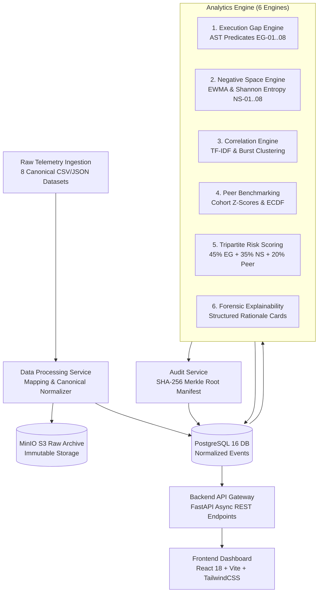

# Sylloge (SAT-SA)

> **Offline, Air-Gapped Supervisory Cybersecurity Analytics Platform**  
> Engineered for **National Critical Information Infrastructure Protection Centre (NCIIPC)** oversight and **Smart India Hackathon (SIH 2026 Problem Statement PS-26157)** under Section 70A of the Information Technology Act, 2000.

---

## 🛡️ Executive Overview

**Sylloge (SAT-SA)** is an enterprise-grade supervisory cybersecurity analytics platform engineered for strict, air-gapped Security Operations Center (SOC) enclaves operating without outbound internet access or third-party cloud dependencies. 

Under national cybersecurity governance frameworks, supervisory authorities oversee cybersecurity operations across hundreds of Critical Sector Entities (CSEs) in Banking, Energy, Telecommunications, Defense, and Transportation. Historically, manual audit sampling covers **less than 3%** of submitted security telemetry, consistently missing sophisticated operational negligence and sensor blind spots.

**Sylloge bridges this gap** by auditing **100% of submitted operational telemetry** in minutes. It surfaces two hidden institutional failure modes:
1. **Execution Gaps ($S_{\text{EG}}$)**: Documented policies dictate rigorous investigation and prompt escalation, but telemetry proves analysts are rubber-stamping critical alerts, bypassing escalation trees, or leaving cases dormant.
2. **Negative Space ($S_{\text{NS}}$)**: Critical telemetry that *ought* to exist is diagnostic by its complete absence—such as total sensor silence on crown-jewel assets, sudden weekend logging cliffs, or telemetry monocultures masking disabled detection rules.

---

## 📚 Master Engineering Documentation System

The complete technical, mathematical, and operational specifications are maintained across **5 authoritative master engineering guides** in [`docs/`](docs/):

| Document | Title | Purpose & Target Audience |
|---|---|---|
| [**Doc 01**](docs/01_PRODUCT_AND_BUSINESS_GUIDE.md) | **Product & Business Guide** | Executive summary, NCIIPC statutory mandate (Section 70A IT Act), user personas, 6 supervisory views, lifecycles, GreenGrid Power Ltd journey, 90s hero demo script, and SIH defense blueprints. |
| [**Doc 02**](docs/02_SYSTEM_ARCHITECTURE.md) | **System Architecture Guide** | 9-layer physical pipeline, 11-layer logical architecture, 5 microservices, PostgreSQL 16 ERD, MinIO S3 topology, inter-service auth, and end-to-end sequence execution flows. |
| [**Doc 03**](docs/03_CODEBASE_AND_TECH_STACK_GUIDE.md) | **Codebase & Tech Stack Guide** | Tech stack selection rationale, directory breakdowns for all services, master file inventory, module dependency graph, and line-by-line upload-to-sealing code walkthrough. |
| [**Doc 04**](docs/04_ANALYTICS_AND_DATA_ENGINE.md) | **Analytics & Data Engine Guide** | Mathematical specifications for all 8 MVP Execution Gap rules (`EG-01`..`08`) + 22 extended rules, 8 MVP Negative Space checks (`NS-01`..`08`) + 22 extended checks, EWMA 3-sigma math, Shannon Entropy, inter-arrival dispersion ($CV$), TF-IDF Cosine/Jaccard, Z-scores, and Tripartite Risk Formula. |
| [**Doc 05**](docs/05_OPERATIONS_DEPLOYMENT_AND_DEVELOPER_GUIDE.md) | **Operations, Deployment & Developer Guide** | Local setup runbooks, environment variable matrices, database migrations, air-gapped Docker Compose deployment, testing runbooks, developer extension tutorials, and troubleshooting guide. |
|

---

## ⚡ Core Features & 6-Engine Analytics Core

- **100% Air-Gapped Native**: Zero external CDN calls, offline bundled static assets, and air-gapped enclave compatibility.
- **Tripartite Risk Scoring Engine**:
  $$\text{Composite Risk Score} = (0.45 \cdot S_{\text{EG}}) + (0.35 \cdot S_{\text{NS}}) + (0.20 \cdot S_{\text{Peer}})$$
  - **Execution Gap Engine (45% Weight)**: AST predicates evaluating SLA breaches (critical alert 2h SLA, P1 escalation > 4h), stale cases (>72h idle), unassigned critical assets, and rapid batch closures (`EG-01` to `EG-08`).
  - **Negative Space Engine (35% Weight)**: EWMA volume cliff detection, missing weekend/off-hours analyst activity, crown-jewel asset uptime drops, and low Shannon entropy ($H(X) < 0.50$) (`NS-01` to `NS-08`).
  - **Peer Benchmark Engine (20% Weight)**: 4-tier cohort resolution hierarchy computing Z-scores and empirical cumulative distributions (ECDF) against sector peer baselines.
- **Correlation & Anti-Gaming Engine**: Multi-alert burst clustering (`CORR-BURST`), TF-IDF note clone detection, and Jaccard similarity (`CORR-TEXT`).
- **Forensic Explainability & Rationale Cards**: Every high-level risk score links directly to human-auditable Rationale Cards, binding metric snapshots to specific database row IDs.
- **Cryptographic Merkle Audit Trail**: Constructs binary SHA-256 Merkle trees over ingested datasets and finding records to guarantee legal, tamper-evident chain-of-custody.
- **Interactive SPA Dashboard**: Real-time entity worklists, multi-axis radar profiles, historical risk trajectory sparklines, and printable PDF compliance dossiers.

---

## 🏗️ System Architecture & Data Flow



---

## 📁 Repository Layout

Every major architectural subsystem includes a focused navigation [`README.md`](README.md):

```text
SAT-SA/
├── analytics_engine/    # 6 Analytics Engines (Execution Gap, Negative Space, Peer, Risk, etc.) -> [analytics_engine/README.md]
├── backend/             # FastAPI REST API Gateway, SQLAlchemy ORM & Auth Routers -> [backend/README.md]
├── data_processing/     # Field Mapping & Canonical Schema Normalization Service -> [data_processing/README.md]
├── audit_service/       # Cryptographic SHA-256 Merkle Root Verification Service -> [audit_service/README.md]
├── shared/              # Shared data models, Pydantic schemas, auth & storage utilities -> [shared/README.md]
├── frontend/            # React 18 SPA Dashboard (Vite, TailwindCSS, Recharts) -> [frontend/README.md]
├── infrastructure/      # Docker Compose stack, Nginx reverse proxy & DB bootstrap scripts -> [infrastructure/README.md]
├── testing/             # Comprehensive 234-test unit, integration & adversarial suites -> [testing/README.md]
├── validation/          # Automated Precision/Recall Validation CLI & Compliance Reporting -> [validation/README.md]
├── alembic/             # Version-controlled relational database schema migrations
└── docs/                # Master 5-Document Engineering & Business Specification System
```

---

## 🛠️ Quickstart & Deployment Guide

### Prerequisites
- **Docker & Docker Compose** (Recommended for production & containerized deployment)
- **Python 3.11+** (For local development & test execution)
- **Node.js 18+ & npm** (For local frontend development)

---

### Option A: One-Click Docker Compose Deployment (Recommended)

1. **Clone Repository & Configure Environment**:
   ```bash
   cp .env.example .env
   ```

2. **Launch the 5-Service Air-Gapped Stack**:
   ```bash
   docker compose up -d --build
   ```

3. **Access Services**:
   - **Frontend Dashboard**: [`http://localhost:3000`](http://localhost:3000)
   - **Backend API Docs (Swagger UI)**: [`http://localhost:8000/docs`](http://localhost:8000/docs)
   - **MinIO Object Console**: [`http://localhost:9001`](http://localhost:9001) 


---

### Option B: Local Manual Development Setup

#### 1. Backend & Analytics Services
```bash
# Create and activate Python virtual environment
python -m venv .venv
source .venv/bin/activate  # On Windows: .venv\Scripts\activate

# Install dependencies across services
pip install -r backend/requirements.txt
pip install -r analytics_engine/requirements.txt
pip install -r data_processing/requirements.txt
pip install -r audit_service/requirements.txt

# Run database migrations
alembic upgrade head

# Start FastAPI API Gateway
uvicorn backend.app.main:app --reload --port 8000
```

#### 2. Frontend Development Server
```bash
cd frontend
npm install
npm run dev
```

---

## 🧪 Testing & Quality Assurance

The codebase includes an extensive **234-test automated verification suite**:

```bash
# Run comprehensive integration and unit test suite
pytest testing/

# Run standalone analytics engine test suite
pytest analytics_engine/tests

# Run data processing normalization test suite
pytest data_processing/tests

# Run automated precision/recall validation CLI against benchmark datasets
python validation/run_validation.py --min-f1 0.90 --min-tier-acc 0.90
```

---

## ⚖️ License & Statutory Attribution

Developed for **Smart India Hackathon (SIH 2026)**.  
Problem Statement: **PS-26157** (Supervisory Analytics for Security Operations Center Telemetry).  
Statutory Reference: **Section 70A, Information Technology Act, 2000 (NCIIPC Mandate)**.


