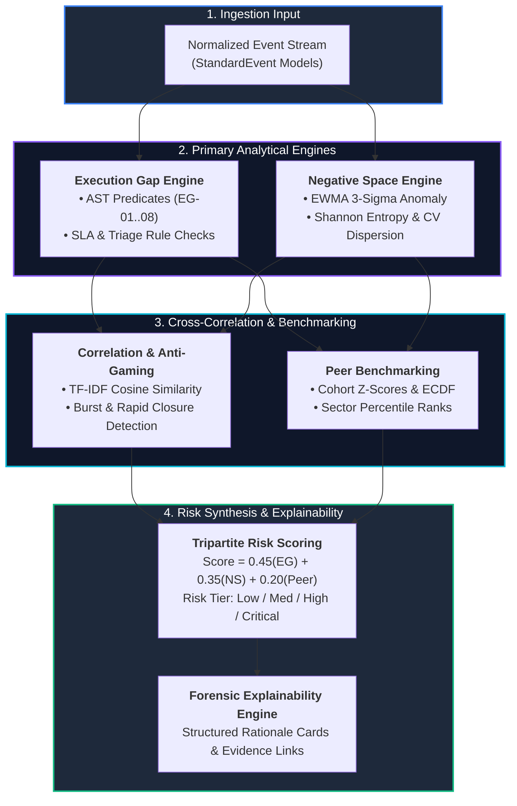

# Analytics Engine Subsystem (`analytics_engine/`)

> **6-Engine Supervisory Analytics Core** evaluating institutional SOC diligence, detecting Execution Gaps, identifying Negative Space, and generating Tripartite Risk Scores.

---

## 🎯 Purpose
- Houses the core supervisory intelligence evaluating operational diligence across regulated entities.
- Runs pure, deterministic AST predicates to uncover operational negligence and SLA bypasses (**Execution Gaps**).
- Computes statistical anomaly algorithms (EWMA 3-sigma, Shannon Entropy, CV dispersion) to detect telemetry absence (**Negative Space**).
- Synthesizes multi-engine findings into an objective, weighted Composite Risk Score (`45% EG + 35% NS + 20% Peer`).

---

## 💎 Why This Subsystem Is Critical
- **Analytical Heart of SAT-SA:** Transforms raw normalized event streams into actionable, evidence-backed supervisory findings.
- **Double-Blind Detection:** Detects both what analysts did wrong (active operational gaps) and what telemetry is suspiciously missing (silence/sensor tampering).
- **Mathematical Objectivity:** Replaces subjective manual spreadsheet audits with deterministic, fully reproducible metrics.

---

## 🧩 Main Components & Directory Map

```text
analytics_engine/app/
├── main.py                         # Standalone FastAPI service entrypoint (Port 8002)
├── engines/                        # The 6 Supervisory Analytics Engines
│   ├── pipeline.py                 # Master orchestrator coordinating all 6 engines
│   ├── execution_gap/              # AST predicate engine evaluating rules EG-01..08
│   ├── negative_space/             # Statistical absence engine (EWMA, Entropy, CV) NS-01..08
│   ├── correlation/                # Anti-gaming engine (Burst clustering & TF-IDF note clone)
│   ├── peer_benchmark/             # Cohort Z-score & ECDF percentile engine
│   ├── risk_scoring/               # Tripartite composite risk synthesis (45/35/20)
│   └── explainability/             # Structured Rationale Card generation engine
├── routers/                        # Analytical API endpoints (/analyze, /findings, /risk-scores)
└── schemas/                        # Request/Response Pydantic validation models
```

---

## ⚙️ Key Responsibilities
- Evaluate **16 core supervisory rules** (8 Execution Gap + 8 Negative Space) against normalized events.
- Detect copy-pasted triage notes and anomalous rapid batch ticket closures.
- Calculate sector peer deviations across 5 core supervisory metrics.
- Output deterministic findings, risk tiers, and explainability cards directly to PostgreSQL.

---

## 🔄 End-to-End Analytics Data Flow



---

## 📚 Related Master Documentation
- [**Doc 02: System Architecture Guide**](../docs/02_SYSTEM_ARCHITECTURE.md) (Section 8: Analytics Engine Service Architecture)
- [**Doc 04: Analytics & Data Engine Guide**](../docs/04_ANALYTICS_AND_DATA_ENGINE.md) (Complete Mathematical & Algorithmic Specification)
- [**Doc 03: Codebase & Tech Stack Guide**](../docs/03_CODEBASE_AND_TECH_STACK_GUIDE.md) (Section 3.3: Analytics Engine Breakdown)

