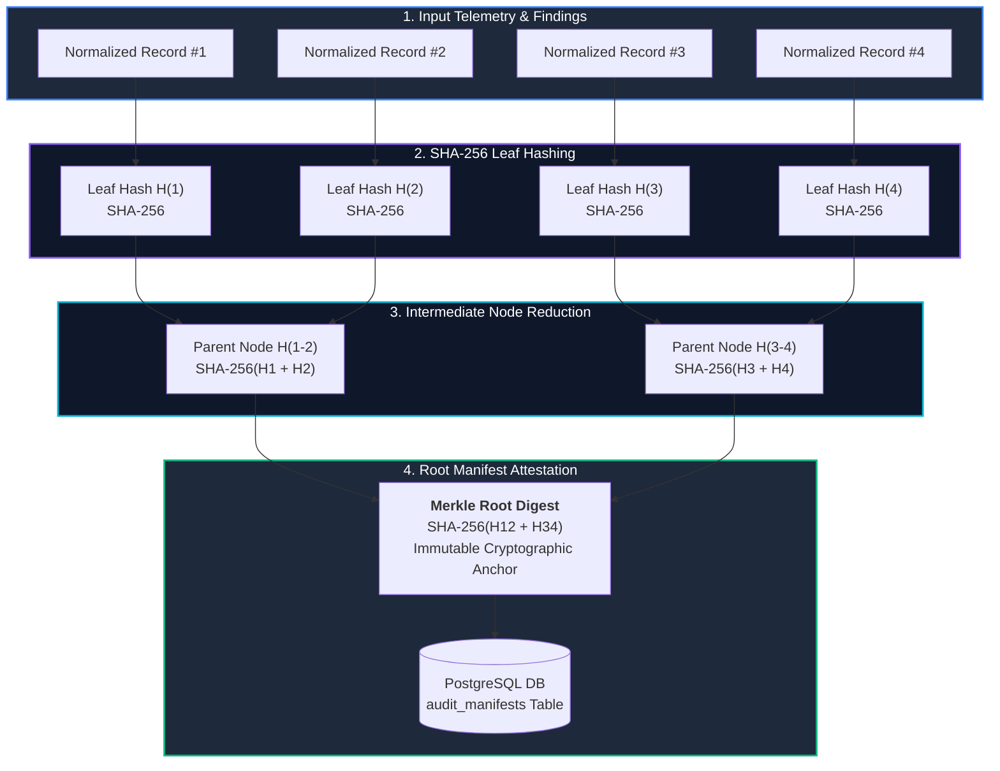

# Cryptographic Audit Service (`audit_service/`)

> **Cryptographic Attestation Microservice** generating binary SHA-256 Merkle trees over ingested telemetry and supervisory findings for court-admissible audit integrity.

---

## 🎯 Purpose
- Provides mathematical non-repudiation and legal tamper-evidence for all supervisory findings and ingested datasets.
- Constructs binary SHA-256 Merkle trees over telemetry events and generated finding records.
- Issues immutable, signed Merkle root manifests stored in PostgreSQL for court-admissible audit integrity.
- Provides cryptographic inclusion proof verification to detect any post-ingestion tampering.

---

## 💎 Why This Subsystem Is Critical
- **Legal Admissibility:** Regulatory mandates under Section 70A IT Act require mathematical proof that evidence was not altered after submission.
- **Chain of Custody:** Guarantees that supervisory findings produced today can be verified against the exact bit-for-bit historical raw telemetry.
- **Zero-Knowledge Proofs:** Enables verification of individual finding authenticity without disclosing the entire raw dataset.

---

## 🧩 Main Components & Directory Map

```text
audit_service/app/
├── main.py                  # Standalone FastAPI service entrypoint (Port 8003)
├── merkle/                  # Pure SHA-256 binary Merkle tree engine & proof builder
├── routers/                 # Cryptographic endpoints (/generate, /verify, /proof)
└── schemas/                 # Merkle leaf, node & manifest Pydantic schemas
```

---

## ⚙️ Key Responsibilities
- Compute leaf hashes over normalized records and finding IDs.
- Build balanced binary Merkle trees and calculate root SHA-256 digests.
- Persist audit manifests in the `audit_manifests` database table.
- Validate cryptographic proof paths for individual record verification.

---

## 🔄 Cryptographic Merkle Tree Pipeline



---

## 📚 Related Master Documentation
- [**Doc 02: System Architecture Guide**](../docs/02_SYSTEM_ARCHITECTURE.md) (Section 9: Cryptographic Audit Service Architecture)
- [**Doc 03: Codebase & Tech Stack Guide**](../docs/03_CODEBASE_AND_TECH_STACK_GUIDE.md) (Section 3.4: Audit Service Breakdown)
- [**Doc 04: Analytics & Data Engine Guide**](../docs/04_ANALYTICS_AND_DATA_ENGINE.md) (Section 8.2: Binary SHA-256 Merkle Trees)

