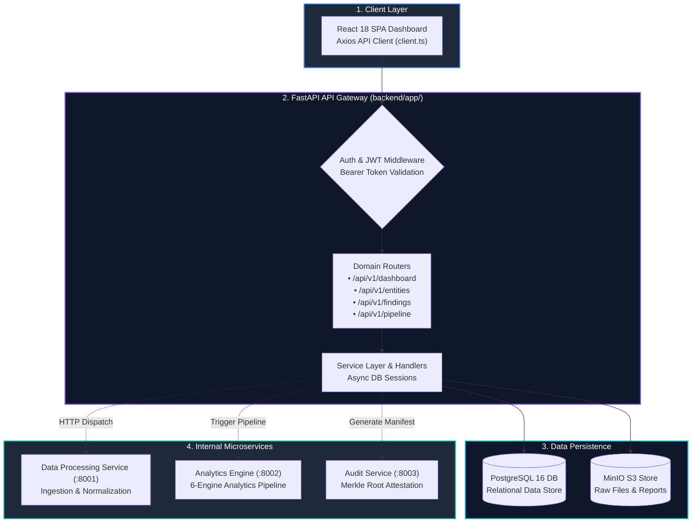

# Backend API Gateway (`backend/`)

> **FastAPI REST API Gateway** orchestrating authentication, entity registries, findings explorer, supervisory reports, and microservice pipeline triggers.

---

## 🎯 Purpose
- Functions as the central API Gateway and orchestration controller for the entire SAT-SA platform.
- Exposes secure, asynchronous REST API endpoints consumed by the React frontend.
- Enforces local authentication, session security, and supervisor role-based access boundaries.
- Coordinates cross-service execution across data processing, analytics, and audit microservices.

---

## 💎 Why This Subsystem Is Critical
- **Platform Ingress Controller:** Central communication hub routing client traffic to storage and analytics services.
- **Security & Authorization:** Enforces air-gapped token validation and Bcrypt password hashing (`rounds=12`).
- **Decoupled Architecture:** Isolates web API presentation from computationally intensive statistical analytics.

---

## 🧩 Main Components & Directory Map

```text
backend/app/
├── main.py                  # FastAPI application entrypoint, CORS & router aggregation
├── config.py                # Environment configurations & microservice URLs
├── routers/                 # Domain-specific REST API endpoints
│   ├── auth.py              # Local Bcrypt JWT login (/api/v1/auth/login)
│   ├── entities.py          # Regulated entity CRUD, risk history & radar metrics
│   ├── submissions.py       # Multi-file telemetry upload & ingestion dispatching
│   ├── findings.py          # Unified findings query, evidence drill-down & notes
│   ├── dashboard.py         # Pre-aggregated worklists & national risk metrics
│   ├── benchmarks.py        # Sector peer cohort distributions & Z-scores
│   ├── pipeline.py          # Analytics pipeline execution triggers
│   ├── reports.py           # PDF compliance audit dossier exports
│   └── health.py            # Microservice liveness & readiness probes
└── services/                # Business logic handlers & inter-service HTTP clients
```

---

## ⚙️ Key Responsibilities
- Validate incoming API payloads using strict Pydantic schemas.
- Route telemetry upload streams to the ingestion service.
- Query and persist normalized records, findings, and risk scores in PostgreSQL.
- Aggregate multi-dimensional metrics for fast frontend rendering.

---

## 🔄 Ingress & Request Orchestration Flow



---

## 📚 Related Master Documentation
- [**Doc 02: System Architecture Guide**](../docs/02_SYSTEM_ARCHITECTURE.md) (Section 6: Backend API Gateway Architecture)
- [**Doc 03: Codebase & Tech Stack Guide**](../docs/03_CODEBASE_AND_TECH_STACK_GUIDE.md) (Section 3.1: Backend Microservice)
- [**Doc 05: Operations & Developer Guide**](../docs/05_OPERATIONS_DEPLOYMENT_AND_DEVELOPER_GUIDE.md) (Section 1: Local Development)
