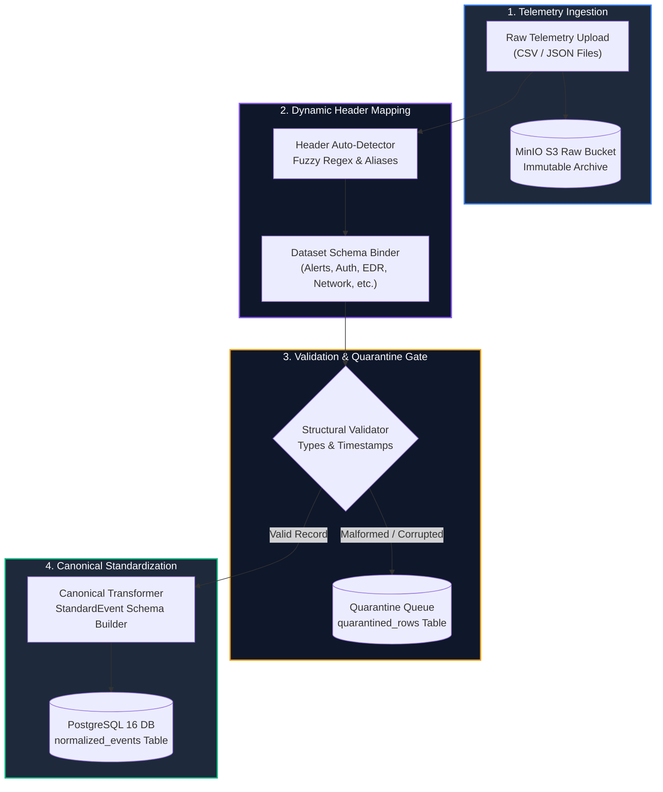

# Data Processing & Ingestion (`data_processing/`)

> **Telemetry Ingestion & Normalizer Microservice** providing dynamic field mapping, structural validation, quarantine error handling, and canonical schema standardization.

---

## 🎯 Purpose
- Ingests, parses, and validates heterogeneous multi-vendor telemetry datasets from Critical Sector Entities.
- Provides dynamic column mapping and header alias auto-detection across arbitrary CSV/JSON formats.
- Enforces strict data-integrity gates via structural validation and a row-level Quarantine Queue.
- Standardizes diverse security logs into a unified, common canonical event schema (`StandardEvent`).

---

## 💎 Why This Subsystem Is Critical
- **Data Ingestion Gatekeeper:** Prevents garbage-in/garbage-out; downstream analytics engines require clean, validated schema objects.
- **Fault-Tolerant Processing:** Corrupted rows are quarantined with descriptive error logs without aborting the entire batch ingestion.
- **Vendor Agnostic:** Decouples proprietary SIEM/EDR log formats (Splunk, QRadar, Sentinel) from SAT-SA rule logic.

---

## 🧩 Main Components & Directory Map

```text
data_processing/app/
├── main.py                  # Standalone FastAPI service entrypoint (Port 8001)
├── mapping/                 # Header auto-detection & column alias mapping engine
├── validation/              # Schema validator, type checker & row quarantine engine
├── normalization/           # Canonical transformer converting records to StandardEvent
├── pipeline/                # Ingestion service coordinating S3 storage & DB writes
└── routers/                 # Ingestion endpoints (/ingest, /validate, /quarantine)
```

---

## ⚙️ Key Responsibilities
- Stream raw CSV/JSON uploads into MinIO S3 object storage for immutable auditing.
- Parse and validate 8 canonical telemetry dataset formats.
- Route malformed records to the `quarantined_rows` database table.
- Bulk-insert normalized events into the `normalized_events` table for analytics consumption.

---

## 🔄 End-to-End Ingestion & Normalization Flow



---

## 📚 Related Master Documentation
- [**Doc 02: System Architecture Guide**](../docs/02_SYSTEM_ARCHITECTURE.md) (Section 7: Data Processing Service Architecture)
- [**Doc 03: Codebase & Tech Stack Guide**](../docs/03_CODEBASE_AND_TECH_STACK_GUIDE.md) (Section 3.2: Data Processing Microservice)
- [**Doc 04: Analytics & Data Engine Guide**](../docs/04_ANALYTICS_AND_DATA_ENGINE.md) (Section 2: Canonical Data Models)

