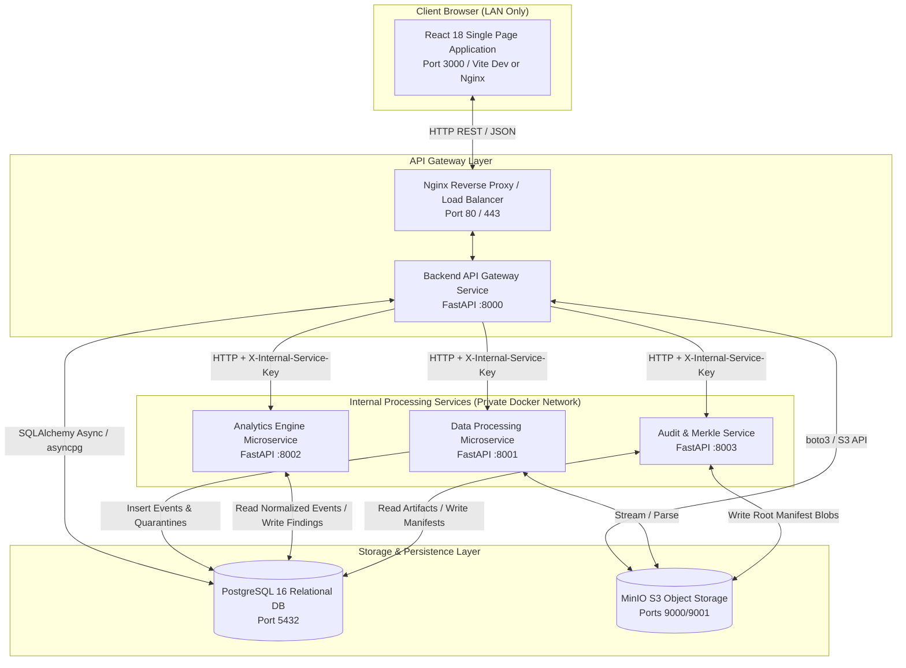
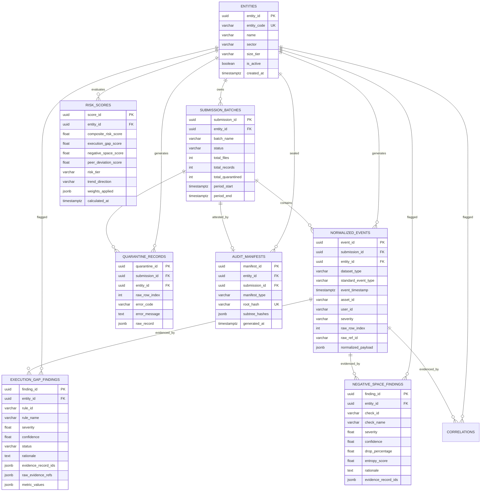
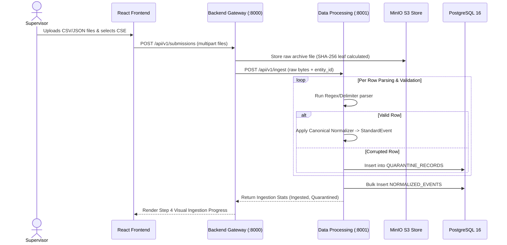
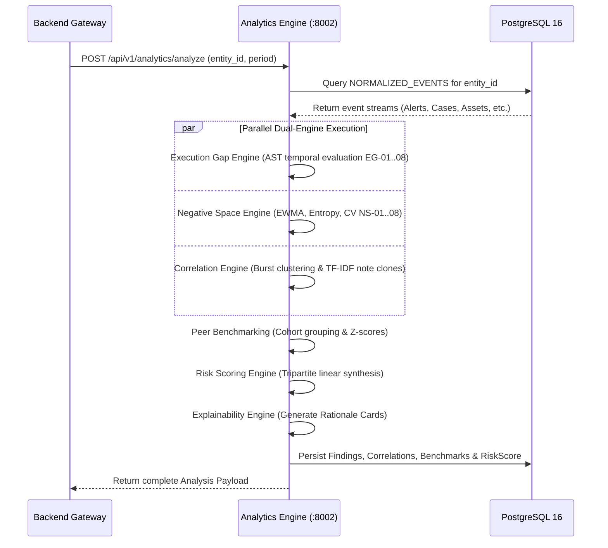
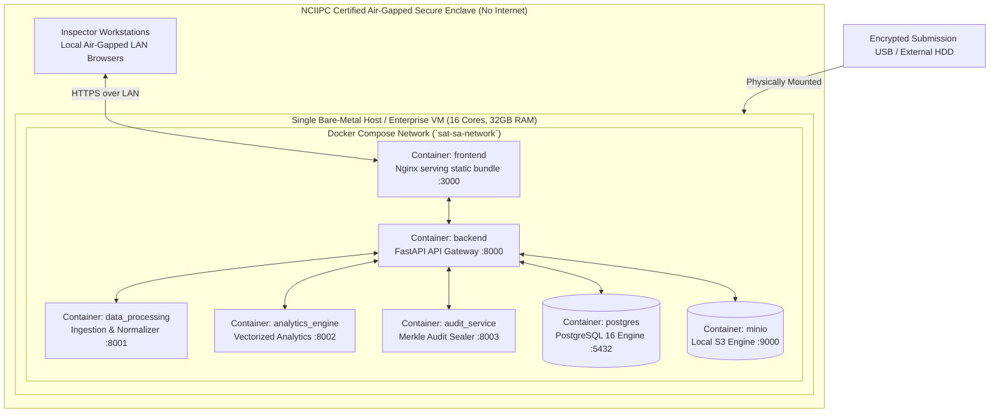

# SAT-SA — System Architecture Guide

> **Document ID:** `02_SYSTEM_ARCHITECTURE.md`  
> **Classification:** Unclassified / Technical Architecture Specification  
> **System Name:** SAT-SA (Sylloge Supervisory Analytics)  
> **Target Problem Statement:** PS-26157 (NCIIPC / National Critical Information Infrastructure Protection Centre)  
> **Target Audience:** Lead System Architects, Senior Software Engineers, DevOps/SREs, Technical Reviewers, and Security Auditors.  
> **Document Purpose:** Complete technical architecture reference defining service topologies, inter-service communication protocols, database and storage schemas, event propagation flows, and fail-closed security models.

---

## Table of Contents

1. [System Overview & Guiding Architectural Principles](#1-system-overview--guiding-architectural-principles)
2. [High-Level System Topology](#2-high-level-system-topology)
3. [The 9-Layer & 11-Logical Layer Reference Architecture](#3-the-9-layer--11-logical-layer-reference-architecture)
4. [Microservices Decomposition](#4-microservices-decomposition)
5. [Frontend Architecture](#5-frontend-architecture)
6. [Backend API Gateway Architecture](#6-backend-api-gateway-architecture)
7. [Data Processing Service Architecture](#7-data-processing-service-architecture)
8. [Analytics Engine Service Architecture](#8-analytics-engine-service-architecture)
9. [Cryptographic Audit Service Architecture](#9-cryptographic-audit-service-architecture)
10. [Database Architecture & Relational Schema](#10-database-architecture--relational-schema)
11. [Object Storage Architecture (MinIO S3)](#11-object-storage-architecture-minio-s3)
12. [Authentication, Security & Secret Management](#12-authentication-security--secret-management)
13. [End-to-End Execution Flows](#13-end-to-end-execution-flows)
    - 13.1 [Raw Telemetry Event Ingestion Flow](#131-raw-telemetry-event-ingestion-flow)
    - 13.2 [Supervisory Finding Generation Flow](#132-supervisory-finding-generation-flow)
    - 13.3 [Tripartite Risk Scoring & Cohort Flow](#133-tripartite-risk-scoring--cohort-flow)
    - 13.4 [Forensic Explainability & Drill-Down Flow](#134-forensic-explainability--drill-down-flow)
    - 13.5 [SHA-256 Merkle Root Sealing & Verification Flow](#135-sha-256-merkle-root-sealing--verification-flow)
14. [Layer-by-Layer Input/Output & Failure Resilience Specification](#14-layer-by-layer-inputoutput--failure-resilience-specification)
15. [Physical Air-Gap Deployment Architecture](#15-physical-air-gap-deployment-architecture)

---

## 1. System Overview & Guiding Architectural Principles

SAT-SA is architected as an **offline-first, microservice-based supervisory analytics platform**. It runs entirely within an air-gapped regulatory enclave without inbound or outbound internet access.

```
+---------------------------------------------------------------------------------------------------+
|                                 CORE ARCHITECTURAL PRINCIPLES                                     |
+---------------------+-----------------------------------------------------------------------------+
| Principle           | Architectural Implementation                                                |
+---------------------+-----------------------------------------------------------------------------+
| 1. Air-Gap Native   | Zero external dependencies at runtime. All packages, model weights,        |
|                     | schemas, and web assets are pre-bundled in offline container images.        |
| 2. Determinism      | Pure mathematical and AST-based logic. Identical inputs produce bit-for-bit |
|                     | identical findings and scores across every execution.                      |
| 3. Isolation &      | Corrupted data rows are redirected to a Quarantine Queue; healthy rows      |
|    Quarantine       | proceed downstream without halting the batch run.                           |
| 4. Forensic Linkage | Every finding retains foreign keys and line-number references back to the   |
|                     | source CSV/JSON records stored in immutable object storage.                 |
| 5. Cryptographic    | Ingested batches, normalized events, and finding sets are sealed in binary  |
|    Non-Repudiation  | SHA-256 Merkle trees for court-admissible attestation.                      |
| 6. Polyglot Design  | Python (FastAPI/NumPy/Pandas) for high-performance vectorized analytics;    |
|                     | TypeScript (React/Vite) for deterministic, type-safe supervisory UI.       |
+---------------------+-----------------------------------------------------------------------------+
```

---

## 2. High-Level System Topology



---

## 3. The 9-Layer & 11-Logical Layer Reference Architecture

SAT-SA operationalizes the **11-Layer Logical Reference Architecture** mapped into **9 Physical Processing Pipeline Layers**:

```
+---------------------------------------------------------------------------------------------------+
|                            THE 9-LAYER PHYSICAL PIPELINE ARCHITECTURE                             |
+---------------------------------------------------------------------------------------------------+
|                                                                                                   |
|  [Layer 1: Offline Ingress & Air-Gap Transport Gate]                                              |
|   - Physical media ingest (USB/HDD), virus scan enclave, strict zero-network boundary.             |
|                                     │                                                             |
|  [Layer 2: Target Supervised Entity Context Store]                                                |
|   - Binds batch to registered CSE (UUID, Sector, Tier-1/2/3, baseline historical score).          |
|                                     │                                                             |
|  [Layer 3: Ingestion & Streaming Chunk Engine]                                                    |
|   - Multi-format parser (CSV, TSV, Semicolon, JSON), file-level SHA-256 leaf hashing.             |
|                                     │                                                             |
|  [Layer 4: Row-Level Validation & Quarantine Engine]                                              |
|   - Schema assertions, type checking. Malformed rows isolated to Quarantine Queue.               |
|                                     │                                                             |
|  [Layer 5: Canonical Normalization Engine]                                                        |
|   - Column aliasing, ISO 8601 UTC timestamp conversion, emits `StandardEvent` stream.             |
|                                     │                                                             |
|  [Layer 6: Relational & Object Persistence Layer]                                                 |
|   - Indexed tables in PostgreSQL 16 + Immutable raw payloads in MinIO S3.                        |
|                                     │                                                             |
|  [Layer 7: Analytics Core (Tripartite Dual Engines)]                                              |
|   - Execution Gap Engine (EG-01..08) + Negative Space Engine (NS-01..08) + Correlation Engine.    |
|                                     │                                                             |
|  [Layer 8: Tripartite Weighted Risk Scoring Engine]                                               |
|   - 45% EG + 35% NS + 20% Peer Cohort Z-score linear combination -> Composite Risk [0-100].      |
|                                     │                                                             |
|  [Layer 9: Forensic Explainability & Merkle Audit Layer]                                          |
|   - Rationale Cards linked to raw CSV row indices + Cryptographic SHA-256 Merkle Root Manifest.   |
|                                                                                                   |
+---------------------------------------------------------------------------------------------------+
|  [Layer 10: Supervisory Dashboard UI]  |  [Layer 11: Cross-Cutting Audit & Governance Ledger]     |
|   - 6 Core Views for human inspectors  |   - Observational append-only run, access & decision log  |
+---------------------------------------------------------------------------------------------------+
```

---

## 4. Microservices Decomposition

The platform is decomposed into **5 independent service containers**:

```
+----+----------------------+------+------------------------+---------------------------------------+
| #  | Service Name         | Port | Tech Stack             | Core Responsibility                   |
+----+----------------------+------+------------------------+---------------------------------------+
| 01 | `frontend`           | 3000 | React 18, Vite, TS     | Supervisory UI, charts, drill-downs   |
| 02 | `backend`            | 8000 | FastAPI, SQLAlchemy    | Gateway routing, auth, entity domain  |
| 03 | `data_processing`    | 8001 | FastAPI, Pydantic      | Ingestion, quarantine, normalizer     |
| 04 | `analytics_engine`   | 8002 | FastAPI, NumPy/Pandas  | EG/NS engines, scoring, rationale     |
| 05 | `audit_service`      | 8003 | FastAPI, hashlib       | Merkle tree calculation & verify      |
| -- | `postgres`           | 5432 | PostgreSQL 16 Alpine   | Structured relational persistence     |
| -- | `minio`              | 9000 | MinIO S3 Server        | Immutable raw & manifest storage      |
+----+----------------------+------+------------------------+---------------------------------------+
```

### 4.1 Inter-Service Authentication Pattern
All inter-service HTTP requests from `backend` to worker services (`data_processing`, `analytics_engine`, `audit_service`) must include the custom header:
```http
X-Internal-Service-Key: <SATSA_INTERNAL_SERVICE_KEY>
```
Requests failing this check are rejected with `HTTP 403 Forbidden` (`shared/auth/service_auth.py`).

---

## 5. Frontend Architecture

### 5.1 Technology Stack
- **Framework:** React 18.3 with Vite 5.2 build tooling
- **Language:** TypeScript 5.4 (Strict Mode enabled)
- **Styling:** TailwindCSS 3.4
- **Icons:** Lucide React
- **Visualizations:** Recharts 2.12 (Radar, Scatter Risk Matrix, Cohort Distributions, Bar Gauges)
- **Routing:** React Router DOM 6.22

### 5.2 Directory Structure & Module Decomposition
```
frontend/src/
├── api/
│   ├── client.ts              # Axios instance with JWT interceptors
│   ├── services.ts            # Typed API methods mapping to Backend endpoints
│   └── mockData.ts            # Fallback fixtures for disconnected testing
├── components/
│   ├── charts/                # Recharts visualizations
│   │   ├── CohortDistributionChart.tsx
│   │   ├── CompositeScoreGauge.tsx
│   │   ├── EngineRadarChart.tsx
│   │   ├── RiskMatrixScatter.tsx
│   │   └── TrendLineChart.tsx
│   ├── common/                # Reusable UI elements (Modals, Badges, Spinners)
│   └── layout/                # Navbar, Sidebar, and AppLayout frame
├── context/
│   ├── AuthContext.tsx        # JWT session storage and user state
│   └── NotificationContext.tsx# Real-time toast notifications
├── pages/                     # The 6 Core Supervisory Views
│   ├── DashboardPage.tsx      # Overview worklist and national metrics
│   ├── UploadWorkflowPage.tsx # 5-Step Ingestion Wizard & 9-layer visualizer
│   ├── EntityRankingPage.tsx  # Entity list, filters, and risk ranking
│   ├── EntityDetailPage.tsx   # Radar charts, score history, entity detail
│   ├── FindingsListPage.tsx   # Central finding repository and filters
│   ├── CaseDrillDownPage.tsx  # Forensic Rationale Card & raw evidence view
│   ├── ReportsListPage.tsx    # Dossier generator and export
│   ├── ReportExportPage.tsx   # Formatted compliance print view
│   ├── AuditTrailPage.tsx     # Merkle root verification console
│   └── LoginPage.tsx          # Local authentication screen
├── types/index.ts             # TypeScript DTO interfaces matching backend Pydantic
└── utils/datasetDetector.ts   # Client-side 8-dataset heuristic classifier
```

---

## 6. Backend API Gateway Architecture

The `backend` microservice acts as the orchestrator and single point of entry for the frontend client.

```
backend/app/
├── config.py                  # Service-specific environment configurations
├── main.py                    # Lifespan manager, CORS, and router registration
├── routers/
│   ├── auth.py                # POST /api/v1/auth/login, /me, /register
│   ├── entities.py            # CRUD /api/v1/entities, /scores, /radar
│   ├── findings.py            # GET /api/v1/findings, /findings/{id}
│   ├── submissions.py         # POST /api/v1/submissions (Upload & trigger)
│   ├── dashboard.py           # GET /api/v1/dashboard/summary, /matrix
│   ├── benchmarks.py          # GET /api/v1/benchmarks/cohorts
│   ├── reports.py             # GET /api/v1/reports/dossier/{entity_id}
│   ├── pipeline.py            # POST /api/v1/pipeline/run-all (Orchestrated batch)
│   └── health.py              # GET /health, /readiness
└── services/
    ├── clients.py             # HTTP clients invoking Data Processing, Analytics, Audit
    └── orchestrator.py        # Pipeline coordinator running Ingest -> Analytics -> Audit
```

---

## 7. Data Processing Service Architecture

The `data_processing` service isolates raw file parsing, validation, and schema normalization.

```
data_processing/app/
├── parsers/                   # Dataset-specific parsers
│   ├── base.py                # BaseParser interface and ParsedRow model
│   ├── csv_parser.py          # Delimiter-agnostic streaming CSV parser
│   ├── json_parser.py         # JSON array and lines parser
│   ├── alert_parser.py        # Schema 01: alert_metadata
│   ├── case_parser.py         # Schema 02: case_management
│   ├── investigation_parser.py# Schema 03: investigation_records
│   ├── escalation_parser.py   # Schema 04: escalation_records
│   ├── asset_parser.py        # Schema 05: asset_inventory
│   ├── incident_parser.py     # Schema 06: incident_reports
│   ├── coverage_parser.py     # Schema 07: coverage_reports
│   └── activity_parser.py     # Schema 08: analyst_activity
├── quarantine/                # Row isolation subsystem
│   ├── errors.py              # ValidationError taxonomy
│   ├── validator.py           # Row schema validation logic
│   └── manager.py             # QuarantineQueue database writer
├── mapping/                   # Canonical translation subsystem
│   ├── defaults.py            # Standard alias tables for all 8 datasets
│   ├── transforms.py          # Timestamp to UTC, severity mapping, type casting
│   ├── normalizer.py          # Generates StandardEvent models
│   └── engine.py              # Dynamic custom mapping engine
└── pipeline/
    └── ingestion_service.py   # High-level pipeline: Parse -> Validate -> Normalize
```

---

## 8. Analytics Engine Service Architecture

The `analytics_engine` service contains the core supervisory detection mathematics.

```
analytics_engine/app/engines/
├── pipeline.py                # AnalyticsPipeline orchestrator executing all 6 engines
├── execution_gap/             # Engine 1: Execution Gap AST Engine
│   ├── default_rules.py       # Declarative rules EG-01 through EG-08
│   ├── interpreter.py         # AST tree recursive condition evaluator
│   ├── registry.py            # In-memory and dynamic rule store
│   ├── engine.py              # Temporal joins, SLA calculations, rubber-stamp windowing
│   └── models.py              # RuleDefinition, TemporalJoin, AST schemas
├── negative_space/            # Engine 2: Statistical Negative Space Engine
│   ├── default_checks.py      # Checks NS-01 through NS-08
│   ├── stats.py               # EWMA 3-sigma, Shannon Entropy, Inter-arrival CV formulas
│   ├── registry.py            # Negative space check registry
│   ├── engine.py              # Absence evaluator over time, assets, and peers
│   └── models.py              # CheckDefinition, NegativeSpaceResult models
├── correlation/               # Engine 3: Multi-Record Correlation Engine
│   ├── burst_clusterer.py     # Same-Asset Sliding 24h burst clustering
│   ├── text_similarity.py     # TF-IDF sparse vectorizer & Cosine/Jaccard note matcher
│   ├── engine.py              # Orchestrates burst and text similarity correlation
│   └── models.py              # CorrelationDraft and BurstCluster models
├── peer_benchmark/            # Engine 4: Sector Cohort Benchmarking Engine
│   ├── metrics.py             # 5 Core Metrics: MTTI, Escalation, Stale, Coverage, EG Rate
│   ├── stats.py               # Z-Score, ECDF Percentile rank calculations
│   ├── cohort.py              # 4-Tier Cohort resolution hierarchy & fallback logic
│   └── engine.py              # Cohort aggregator and low-sample dampener
├── risk_scoring/              # Engine 5: Tripartite Risk Scoring Engine
│   ├── formulas.py            # Tripartite linear combination & logarithmic scaling
│   ├── engine.py              # Evaluates composite risk score, band, and trend
│   └── models.py              # RiskScoreDraft schema
└── explainability/            # Engine 6: Forensic Explainability Engine
    ├── card_builder.py        # Rationale Card generator with metric snapshots
    ├── engine.py              # Converts raw findings into structured explainable cards
    └── models.py              # RationaleCard schema
```

---

## 9. Cryptographic Audit Service Architecture

The `audit_service` microservice provides tamper-evident cryptographic sealing.

```
audit_service/app/
├── merkle/                    # Binary Merkle Tree implementation
│   ├── tree.py                # Deterministic SHA-256 tree builder
│   └── proofs.py              # Inclusion proof generator and validator
├── manifest/                  # Manifest lifecycle management
│   ├── generator.py           # Builds composite root from subtrees (Raw, Quarantined, Events, Findings)
│   └── verifier.py            # Recomputes and verifies manifests against stored state
└── routers/
    ├── manifest.py            # POST /api/v1/manifest/generate, /verify
    └── health.py              # Service health status
```

---

## 10. Database Architecture & Relational Schema

SAT-SA uses **PostgreSQL 16** with indexed relational foreign keys and JSONB payload flexibility:



---

## 11. Object Storage Architecture (MinIO S3)

SAT-SA utilizes a local, self-hosted MinIO instance to ensure immutable data retention:

```
+-----------------------------------------------------------------------------------------------+
|                                  MINIO S3 BUCKET HIERARCHY                                    |
+-------------------+---------------------------------------------------------------------------+
| Bucket Name       | Contents & Storage Policy                                                 |
+-------------------+---------------------------------------------------------------------------+
| `raw-submissions` | Immutable raw CSV/JSON uploads:                                           |
|                   | `/{entity_code}/{submission_id}/{dataset_type}_{sha256}.raw`              |
|                   | Policy: Write-Once-Read-Many (WORM), encrypted at rest.                   |
|                   |                                                                           |
| `quarantine-logs` | JSON dumps of quarantined rows per submission batch for regulatory proof. |
|                   |                                                                           |
| `audit-manifests` | Canonical signed JSON manifests and Merkle tree leaf arrays.              |
+-------------------+---------------------------------------------------------------------------+
```

---

## 12. Authentication, Security & Secret Management

1. **Local Authentication Engine:** Offline JWT tokens signed via `HS256` using a securely generated secret key (`JWT_SECRET_KEY`). Passwords hashed with `bcrypt` (12 rounds).
2. **Local Role-Based Access Control (RBAC):**
   - `SUPERVISOR`: Read-only access to worklists, reports, and evidence drill-down.
   - `INVESTIGATOR`: Deep access to raw evidence, case notes, and finding management.
   - `ADMIN`: Batch upload, entity registration, system configuration, and audit verification.
3. **Internal Inter-Service Guard:** `X-Internal-Service-Key` header validation prevents unauthorized API calls across private network boundaries.

---

## 13. End-to-End Execution Flows

### 13.1 Raw Telemetry Event Ingestion Flow



### 13.2 Supervisory Finding Generation Flow



### 13.3 Tripartite Risk Scoring & Cohort Flow
$$\text{Composite Score} = (0.45 \cdot S_{\text{EG}}) + (0.35 \cdot S_{\text{NS}}) + (0.20 \cdot S_{\text{Peer}})$$
Where $S_{\text{EG}}$ is logarithmically scaled by volume:
$$\text{ScaleFactor} = \max(10.0, 5.0 \cdot \log_{10}(N_{\text{alerts}} + 10))$$
$$S_{\text{Peer}} = \min(100.0, \max(0.0, 50.0 + 15.0 \cdot \bar{Z}_{\text{risk}}))$$

### 13.4 Forensic Explainability & Drill-Down Flow
Inspector clicks Finding `EG-02` $\rightarrow$ UI requests `/api/v1/findings/{id}` $\rightarrow$ Backend queries DB for `evidence_record_ids` and `raw_evidence_refs` $\rightarrow$ Backend fetches raw CSV line index from `NORMALIZED_EVENTS` $\rightarrow$ UI highlights the exact row #412 in the source submission.

### 13.5 SHA-256 Merkle Root Sealing & Verification Flow
$$\text{Root SHA-256} = \text{SHA256}(\text{SortConcat}(H_{\text{raw}} \parallel H_{\text{quarantine}} \parallel H_{\text{events}} \parallel H_{\text{findings}}))$$
The `audit_service` independently recalculates this hash to verify that no findings or raw files were modified post-ingestion.

---

## 14. Layer-by-Layer Input/Output & Failure Resilience Specification

```
+----+----------------------+-----------------------+-----------------------+---------------------------------------+
| L# | Layer Name           | Inputs                | Outputs               | Fail-Closed Behavior on Error         |
+----+----------------------+-----------------------+-----------------------+---------------------------------------+
| 01 | Air-Gap Transport    | Physical Media        | Byte stream in buffer | Media read error -> Reject batch      |
| 02 | Entity Context Store | CSE Registry ID       | Entity context object | Unknown CSE -> Abort pipeline         |
| 03 | Ingestion Parser     | Raw File Bytes        | Structured Row Stream | File corrupt -> Quarantine whole file |
| 04 | Validation & Quaran. | Raw Rows              | Clean Rows + Quaran.  | Row invalid -> Isolate to Quarantine  |
| 05 | Normalization Engine | Clean Custom Rows     | StandardEvent Stream  | Unmapped type -> Default & log warning|
| 06 | Persistence Layer    | StandardEvents        | Indexed DB Records    | DB write fail -> Rollback transaction |
| 07 | Analytics Core       | StandardEvents + CMDB | Typed Finding Drafts  | Rule error -> Skip rule, log finding  |
| 08 | Risk Scoring Engine  | Finding Severities    | Composite Risk [0-100]| Missing engine -> Fallback reweight   |
| 09 | Explainability/Audit | Scores & Evidence IDs | Cards + Merkle Root   | Merkle mismatch -> Raise Tamper Alarm |
| 10 | Dashboard UI         | REST JSON Payloads    | Interactive DOM Charts| API down -> Render cached offline data|
| 11 | Governance Ledger    | Audit Event Stream    | Immutable Audit Trail | Audit fail -> Block triggering action |
+----+----------------------+-----------------------+-----------------------+---------------------------------------+
```

---

## 15. Physical Air-Gap Deployment Architecture



---
*End of Document 02 — System Architecture Guide. For folder structures, module APIs, and file inventories, refer to `03_CODEBASE_AND_TECH_STACK_GUIDE.md`.*
