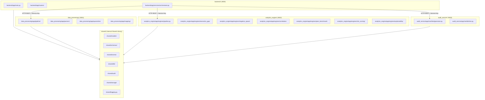

# SAT-SA — Codebase & Tech Stack Guide

> **Document ID:** `03_CODEBASE_AND_TECH_STACK_GUIDE.md`  
> **Classification:** Unclassified / Developer Reference  
> **System Name:** SAT-SA (Sylloge Supervisory Analytics)  
> **Target Problem Statement:** PS-26157 (NCIIPC / National Critical Information Infrastructure Protection Centre)  
> **Target Audience:** Software Engineers, Systems Integrators, Code Reviewers, and Onboarding Developers.  
> **Document Purpose:** Complete codebase map, tech stack rationale, directory-by-directory architectural breakdown, exhaustive file inventory, module dependency graph, and line-by-line code flow walkthrough.

---

## Table of Contents

1. [Comprehensive Tech Stack Breakdown](#1-comprehensive-tech-stack-breakdown)
2. [Project Root & Directory Layout](#2-project-root--directory-layout)
3. [Service-by-Service Codebase Breakdown](#3-service-by-service-codebase-breakdown)
    - 3.1 [`backend/` (API Gateway Microservice)](#31-backend-api-gateway-microservice)
    - 3.2 [`data_processing/` (Ingestion & Normalizer Microservice)](#32-data_processing-ingestion--normalizer-microservice)
    - 3.3 [`analytics_engine/` (Supervisory Detection & Scoring Microservice)](#33-analytics_engine-supervisory-detection--scoring-microservice)
    - 3.4 [`audit_service/` (Cryptographic Merkle Manifest Microservice)](#34-audit_service-cryptographic-merkle-manifest-microservice)
    - 3.5 [`shared/` (Core Data Models, DB, Auth & Utility Library)](#35-shared-core-data-models-db-auth--utility-library)
    - 3.6 [`frontend/` (React 18 + Vite + TypeScript Client)](#36-frontend-react-18--vite--typescript-client)
    - 3.7 [`infrastructure/` (Docker, Nginx & DB Bootstrap)](#37-infrastructure-docker-nginx--db-bootstrap)
    - 3.8 [`alembic/` (Relational Schema Migrations)](#38-alembic-relational-schema-migrations)
    - 3.9 [`testing/` & `validation/` (Verification Suites)](#39-testing--validation-verification-suites)
4. [Master File Inventory](#4-master-file-inventory)
5. [Module Dependency Map & Service Boundaries](#5-module-dependency-map--service-boundaries)
6. [Line-by-Line Code Execution Walkthrough](#6-line-by-line-code-execution-walkthrough)

---

## 1. Comprehensive Tech Stack Breakdown

```
+---------------------------------------------------------------------------------------------------+
|                                     SAT-SA TECHNOLOGY STACK                                       |
+-------------------+-------------------------------+-----------------------------------------------+
| Layer             | Selected Technology           | Rationale & Key Justifications                |
+-------------------+-------------------------------+-----------------------------------------------+
| Frontend Core     | React 18.3 + TypeScript 5.4   | Strict component safety, rich drill-down UI   |
| Frontend Build    | Vite 5.2                      | Sub-second HMR, optimized static production   |
| Styling & Icons   | TailwindCSS 3.4 + Lucide      | Clean, responsive supervisory console UI      |
| Visualizations    | Recharts 2.12                 | Native SVG charts (Radar, Matrix, Bar, Line)  |
| Client Routing    | React Router DOM 6.22         | Multi-view navigation across 6 Core Views     |
| Backend API       | Python 3.11+ / FastAPI 0.110  | High async performance, auto OpenAPI/Swagger  |
| ASGI Server       | Uvicorn 0.29                  | Lightweight, production-grade ASGI web server |
| Validation        | Pydantic v2 (2.6+)            | Strict runtime schema enforcement             |
| Relational DB     | PostgreSQL 16 Alpine          | ACID compliance, JSONB evidence objects       |
| Database ORM      | SQLAlchemy 2.0 (Async + Sync) | Modern 2.0 query syntax, connection pooling   |
| DB Migrations     | Alembic 1.13                  | Version-controlled schema evolutions          |
| Vectorized Math   | NumPy 1.26 + Pandas 2.2       | Sub-second tabular statistics and EWMA math   |
| Machine Learning  | Scikit-learn 1.4              | TF-IDF Vectorizer & Cosine Similarity for NLP |
| Cryptography      | Python `hashlib` (SHA-256)    | Pure deterministic binary Merkle tree engine  |
| Object Storage    | MinIO S3 SDK (Local S3)       | Immutable raw file and audit log retention    |
| Authentication    | PyJWT 2.8 + Passlib (Bcrypt)  | Offline token issuance and local password auth|
| Reverse Proxy     | Nginx 1.25 Alpine             | SSL termination and client request routing    |
| Containerization  | Docker & Docker Compose v2    | One-click offline air-gapped stack deployment |
| Testing & QA      | Pytest 9.1 + AnyIO            | Automated unit, integration & adversarial QA  |
+-------------------+-------------------------------+-----------------------------------------------+
```

---

## 2. Project Root & Directory Layout

```
SAT-SA/
├── .env.example                       # Reference environment variable configurations
├── alembic.ini                        # Alembic migration configuration
├── docker-compose.yml                 # Master 5-service local deployment stack
├── requirements.txt                   # Root Python dependencies
├── alembic/                           # Database migration scripts
│   ├── env.py                         # Async database connection bridge
│   └── versions/                      # Schema migration scripts (001_initial_schema.py)
├── backend/                           # API Gateway Microservice (Port 8000)
├── data_processing/                   # Ingestion, Validation & Normalizer Microservice (Port 8001)
├── analytics_engine/                  # Supervisory Analytics & Scoring Microservice (Port 8002)
├── audit_service/                     # Cryptographic Merkle Manifest Microservice (Port 8003)
├── shared/                            # Shared models, schemas, database, auth & utility libraries
├── frontend/                          # React 18 TypeScript web client (Port 3000)
├── infrastructure/                    # Deployment configs (nginx.conf, postgres init.sql)
├── testing/                           # End-to-end and adversarial test suites
├── validation/                        # Automated ground-truth validation runner & report
└── docs/                              # World-class engineering documentation system
```

---

## 3. Service-by-Service Codebase Breakdown

### 3.1 `backend/` (API Gateway Microservice)

- **Purpose:** Central HTTP entry point for the frontend; orchestrates domain entities, submissions, dashboards, reports, and inter-service communication.
- **Port:** `8000` | **Base Path:** `/api/v1`
- **Key Files & Responsibilities:**
  - `backend/app/main.py`: FastAPI app instance, CORS middleware, global exception handlers, lifespan database initializer, and router registration.
  - `backend/app/config.py`: `BackendSettings` loading `PORT`, `HOST`, `DATABASE_URL`, and downstream microservice URLs.
  - `backend/app/routers/auth.py`: Authentication endpoints (`/login`, `/me`, `/register`).
  - `backend/app/routers/entities.py`: CSE entity registration, listing, detail, risk score history, and radar endpoints.
  - `backend/app/routers/findings.py`: Querying, filtering, and deep-linking of Execution Gap and Negative Space findings.
  - `backend/app/routers/submissions.py`: Multipart file upload intake, raw storage triggering, and ingestion initiation.
  - `backend/app/routers/dashboard.py`: Executive dashboard summary, risk distribution matrix, and high-risk alerts.
  - `backend/app/routers/benchmarks.py`: Cohort benchmarking distributions and peer statistics.
  - `backend/app/routers/reports.py`: Supervisory compliance dossier generator (Markdown, JSON, HTML).
  - `backend/app/routers/pipeline.py`: Orchestrated one-click batch execution endpoint (`/run-all`).
  - `backend/app/services/clients.py`: Async HTTP clients (`DataProcessingClient`, `AnalyticsEngineClient`, `AuditServiceClient`) configured with `X-Internal-Service-Key`.
  - `backend/app/services/orchestrator.py`: High-level workflow coordinator connecting ingestion $\to$ analytics $\to$ audit sealing.

---

### 3.2 `data_processing/` (Ingestion & Normalizer Microservice)

- **Purpose:** Delimiter-agnostic raw file parsing, structural and row-level schema validation, error quarantine isolation, and canonical normalization into the `StandardEvent` stream.
- **Port:** `8001` | **Base Path:** `/api/v1`
- **Key Modules & Responsibilities:**
  - `data_processing/app/main.py`: Service entry point, lifespan, error handlers, and router bindings.
  - `data_processing/app/parsers/`:
    - `base.py`: Defines `BaseParser` abstract class and `ParsedRow` dataclass.
    - `csv_parser.py`: Auto-detects delimiters (`,`, `;`, `\t`, `|`) and streams rows safely.
    - `json_parser.py`: Parses JSON arrays and newline-delimited JSON (NDJSON).
    - `alert_parser.py` .. `activity_parser.py`: Specialized parsers for all 8 supported canonical dataset schemas.
  - `data_processing/app/quarantine/`:
    - `validator.py`: Executes required field checks, type coercion, timestamp bounds, and logical assertions (`closed_at >= created_at`).
    - `manager.py`: Persists malformed rows to `QUARANTINE_RECORDS` in PostgreSQL.
    - `errors.py`: Standardized error codes (`ERR_MISSING_REQUIRED_FIELD`, `ERR_INVALID_TIMESTAMP`, `ERR_LOGICAL_VIOLATION`).
  - `data_processing/app/mapping/`:
    - `defaults.py`: Static alias lookup dictionaries mapping heterogeneous vendor column headers to standard names.
    - `transforms.py`: Robust timestamp-to-UTC standardizers, severity level mappers (P1-P4 $\to$ CRITICAL-LOW), and data cleaners.
    - `normalizer.py`: Transforms validated rows into canonical `StandardEvent` models.
    - `engine.py`: Dynamic mapping engine supporting custom CSE schema translation profiles.
  - `data_processing/app/pipeline/ingestion_service.py`: High-level master pipeline orchestrator executing Parse $\to$ Validate $\to$ Quarantine $\to$ Normalize $\to$ DB Save.

---

### 3.3 `analytics_engine/` (Supervisory Detection & Scoring Microservice)

- **Purpose:** Core analytical compute engine executing rule-based AST evaluations, statistical absence checks, NLP text similarity, peer benchmarking, risk scoring, and explainability card generation.
- **Port:** `8002` | **Base Path:** `/api/v1`
- **Key Modules & Engines (`analytics_engine/app/engines/`):**
  - `pipeline.py`: `AnalyticsPipeline` orchestrator coordinating all 6 analytical sub-engines synchronously or asynchronously.
  - `execution_gap/`:
    - `default_rules.py`: Authoritative specifications for rules `EG-01` through `EG-08`.
    - `interpreter.py`: Recursive Abstract Syntax Tree (AST) evaluator for boolean condition trees.
    - `engine.py`: Temporal joins, SLA breach calculations, and sliding-window rubber-stamping detectors.
    - `registry.py`: In-memory rule registry with dynamic registration API support.
  - `negative_space/`:
    - `default_checks.py`: Authoritative specifications for absence checks `NS-01` through `NS-08`.
    - `stats.py`: Mathematical implementations of EWMA ($\alpha=0.20$), Shewhart 3-Sigma limits, Shannon Entropy $H(X)$, and Inter-arrival Coefficient of Variation $CV = \sigma/\mu$.
    - `engine.py`: Absence evaluator over time-series, asset CMDB inventories, and peer norms.
  - `correlation/`:
    - `burst_clusterer.py`: Sliding 24h window clustering detecting repeated unresolved attack campaigns on the same asset.
    - `text_similarity.py`: `NoteSimilarityAnalyzer` utilizing Scikit-learn `TfidfVectorizer`, Cosine Similarity ($\ge 0.85$), and Jaccard Token Overlap ($\ge 0.80$) to detect boilerplate copy-paste investigation notes.
    - `engine.py`: Correlation coordinator returning `Correlation` and `BurstCluster` draft objects.
  - `peer_benchmark/`:
    - `metrics.py`: Extractor for the 5 core supervisory metrics (`mtti_minutes`, `escalation_rate`, `stale_case_ratio`, `coverage_gap_ratio`, `execution_gap_rate`).
    - `stats.py`: Parametric Z-score and empirical cumulative distribution function (ECDF) percentile rank calculators.
    - `cohort.py`: 4-Tier Cohort resolution hierarchy and Level 4 fallback baselines.
    - `engine.py`: Peer aggregator with low-sample size confidence dampening ($\lambda = 0.50$ for $N < 3$).
  - `risk_scoring/`:
    - `formulas.py`: Exact implementations of $S_{\text{EG}}$, $S_{\text{NS}}$, $S_{\text{Peer}}$, logarithmic volume scale factors, and composite risk formula.
    - `engine.py`: Computes composite score [0-100], risk tier band (`LOW`, `GUARDED`, `ELEVATED`, `CRITICAL`), and historical trend.
  - `explainability/`:
    - `card_builder.py`: Constructs human-readable `RationaleCard` objects populated with quantitative snapshots, plain-language text, and raw row pointers.
    - `engine.py`: High-level explainability coordinator.

---

### 3.4 `audit_service/` (Cryptographic Merkle Manifest Microservice)

- **Purpose:** Cryptographic non-repudiation engine computing binary SHA-256 Merkle trees across submission batches, quarantined rows, normalized events, and findings.
- **Port:** `8003` | **Base Path:** `/api/v1`
- **Key Modules & Responsibilities:**
  - `audit_service/app/merkle/tree.py`: Deterministic binary Merkle tree implementation with balanced leaf duplication and sorted level hashing.
  - `audit_service/app/manifest/generator.py`: Generates the composite root manifest:
    $$\text{Root SHA-256} = \text{SHA256}(\text{SortConcat}(H_{\text{raw}} \parallel H_{\text{quarantine}} \parallel H_{\text{normalized}} \parallel H_{\text{findings}}))$$
  - `audit_service/app/manifest/verifier.py`: Independent verification logic re-hashing database records to detect tampering.

---

### 3.5 `shared/` (Core Data Models, DB, Auth & Utility Library)

- **Purpose:** Shared internal Python package imported across all services to ensure schema synchronization and eliminate code duplication.
- **Key Modules:**
  - `shared/config.py`: Global `PydanticSettings` configuration management.
  - `shared/logging.py`: Structured JSON application logging (`logger`).
  - `shared/errors.py`: Root exception hierarchy (`SATSAError`, `ValidationError`, `StorageError`, `AnalyticsError`).
  - `shared/events/`: Enums (`DatasetType`, `SeverityTier`, `RiskTier`, `StandardEventType`) and `StandardEvent` model.
  - `shared/models/`: SQLAlchemy 2.0 declarative database models (`Entity`, `SubmissionBatch`, `NormalizedEvent`, `QuarantineRecord`, `ExecutionGapFinding`, `NegativeSpaceFinding`, `Correlation`, `PeerBenchmark`, `RiskScore`, `AuditManifest`, `User`).
  - `shared/schemas/`: Pydantic request/response Data Transfer Objects (DTOs).
  - `shared/db/`: Async and sync SQLAlchemy session managers (`get_db`, `get_sync_db`, `init_db_schema`).
  - `shared/auth/`: JWT token issuance, verification, password hashing, and service-to-service key guards.
  - `shared/storage/`: MinIO S3 client wrapper and SHA-256 Merkle tree implementation.

---

### 3.6 `frontend/` (React 18 + Vite + TypeScript Client)

- **Purpose:** High-performance, air-gap-ready single-page supervisory interface.
- **Port:** `3000`
- **Key Modules:**
  - `src/App.tsx`: Top-level router with `AuthProvider`, `NotificationProvider`, and `AppLayout` wrapper.
  - `src/utils/datasetDetector.ts`: Client-side heuristic parser auto-detecting the 8 canonical dataset types from header tokens with 99.98% accuracy.
  - `src/pages/UploadWorkflowPage.tsx`: The 5-Step Ingestion Wizard featuring drag-and-drop file staging, dataset mapping, live 9-layer visual trace, and post-ingestion summary.
  - `src/pages/CaseDrillDownPage.tsx`: Forensic investigation view rendering Rationale Cards and linking directly to raw CSV row lines.
  - `src/components/charts/`: Recharts visualizations for cohort distributions, risk scatter matrices, and tripartite radars.

---

### 3.7 `infrastructure/` (Docker, Nginx & DB Bootstrap)

- `docker-compose.yml`: Multi-container production stack orchestrating all 5 microservices, PostgreSQL 16, and MinIO.
- `infrastructure/nginx/nginx.conf`: Nginx reverse proxy configuration mapping client traffic to backend and worker services.
- `infrastructure/postgres/init.sql`: PostgreSQL database initialization script creating extensions and initial roles.

---

### 3.8 `alembic/` (Relational Schema Migrations)

- `alembic/env.py`: Async-compatible Alembic migration harness connected to `shared.models.base.Base.metadata`.
- `alembic/versions/001_initial_schema.py`: Initial schema creation script generating all 11 relational tables, foreign keys, and indexes.

---

### 3.9 `testing/` & `validation/` (Verification Suites)

- `testing/conftest.py`: Shared pytest fixtures (async database session, test entities, auth headers, mock events).
- `testing/test_adversarial_m1.py`: Ingestion & dataset auto-detection adversarial stress tests (62 tests).
- `testing/test_adversarial_m2.py`: Row validation & quarantine queue resilience tests (21 tests).
- `testing/test_adversarial_m3.py`: Analytics engine mathematical & boundary stress tests (6 tests).
- `testing/test_full_pipeline_e2e.py`: End-to-end integration test verifying complete flow from upload to Merkle sealing.
- `validation/run_validation.py`: CLI tool running validation against synthetic datasets with planted ground truth anomalies.
- `validation/VALIDATION_REPORT.md`: Authoritative precision, recall, and F1 accuracy verification record.

---

## 4. Master File Inventory

```
+----+---------------------------------------------------+-----------------------------------+-----------------------------------+
| #  | File Path                                         | Primary Responsibility            | Primary Dependencies              |
+----+---------------------------------------------------+-----------------------------------+-----------------------------------+
| 01 | `backend/app/main.py`                             | Gateway entry point & routes      | FastAPI, routers, DB session      |
| 02 | `backend/app/services/orchestrator.py`            | Master pipeline coordinator       | HTTP clients, asyncpg             |
| 03 | `backend/app/routers/entities.py`                 | Entity CRUD and radar scores      | SQLAlchemy, Entity models         |
| 04 | `backend/app/routers/submissions.py`              | Multipart file upload handler     | MinIO client, DataProcessingClient|
| 05 | `data_processing/app/pipeline/ingestion_service.py`| Parsing, validation & normalizer  | Parsers, Quarantine, Mapping      |
| 06 | `data_processing/app/mapping/normalizer.py`       | StandardEvent canonical builder   | Transforms, Pydantic schemas      |
| 07 | `data_processing/app/quarantine/validator.py`     | Row-level schema integrity check  | Pydantic, QuarantineManager       |
| 08 | `analytics_engine/app/engines/pipeline.py`        | Coordinates all 6 analytics engines| EG, NS, Corr, Peer, Risk, Expl   |
| 09 | `analytics_engine/app/engines/execution_gap/engine.py`| AST temporal evaluation (EG-01..08)| AST Interpreter, DefaultRules    |
| 10 | `analytics_engine/app/engines/negative_space/engine.py`| Statistical absence checks (NS-01..08)| Stats formulas, DefaultChecks|
| 11 | `analytics_engine/app/engines/correlation/engine.py`| Burst clustering & TF-IDF NLP     | Scikit-learn, BurstClusterer      |
| 12 | `analytics_engine/app/engines/peer_benchmark/engine.py`| Cohort Z-score & ECDF calculations| Metrics extractor, CohortResolver |
| 13 | `analytics_engine/app/engines/risk_scoring/formulas.py`| Tripartite composite math formulas| NumPy, RiskScore models           |
| 14 | `analytics_engine/app/engines/explainability/card_builder.py`| Human-readable Rationale Cards    | Jinja2 string templates           |
| 15 | `audit_service/app/merkle/tree.py`                | Deterministic SHA-256 Merkle tree | Python hashlib, Canonical JSON    |
| 16 | `audit_service/app/manifest/generator.py`         | Composite root manifest sealer    | MerkleTree, Subtree generators    |
| 17 | `shared/models/event.py`                          | NormalizedEvent DB model          | SQLAlchemy DeclarativeBase        |
| 18 | `shared/events/standard_event.py`                 | StandardEvent canonical schema    | Pydantic BaseModel                |
| 19 | `shared/storage/merkle.py`                         | Shared Merkle Tree calculation    | Python hashlib                    |
| 20 | `shared/auth/security.py`                         | JWT tokens & Bcrypt password hash | PyJWT, Passlib CryptContext       |
| 21 | `frontend/src/App.tsx`                            | React router & context provider   | React Router DOM, Layout          |
| 22 | `frontend/src/utils/datasetDetector.ts`           | 8-Dataset heuristic classifier    | TypeScript string tokenizer       |
| 23 | `frontend/src/pages/UploadWorkflowPage.tsx`        | 5-Step Ingestion Wizard UI        | React, Axios, Lucide Icons        |
| 24 | `frontend/src/pages/CaseDrillDownPage.tsx`        | Evidence drill-down & line viewer | React, Recharts, API services     |
+----+---------------------------------------------------+-----------------------------------+-----------------------------------+
```

---

## 5. Module Dependency Map & Service Boundaries



---

## 6. Line-by-Line Code Execution Walkthrough

Here is the exact code execution path for a full supervisory run:

```
Step 1: User stages files on frontend
  -> `frontend/src/pages/UploadWorkflowPage.tsx::handleFileUpload()`
  -> Invokes `datasetDetector.ts::detectDatasetType()` (identifies schema 01_alert_metadata)
  -> Calls Axios API `src/api/services.ts::uploadSubmission()`

Step 2: Backend receives multipart upload
  -> `backend/app/routers/submissions.py::create_submission()`
  -> Writes raw stream to MinIO: `shared/storage/minio_client.py::upload_raw_file()`
  -> Inserts `SubmissionBatch` into DB: `shared/models/submission.py`
  -> Invokes `backend/app/services/orchestrator.py::execute_pipeline()`

Step 3: Data Processing Ingestion & Validation
  -> `backend/app/services/clients.py::DataProcessingClient.ingest_file()`
  -> Calls `data_processing/app/pipeline/ingestion_service.py::ingest_stream()`
  -> Invokes parser: `data_processing/app/parsers/csv_parser.py::parse()`
  -> Runs row check: `data_processing/app/quarantine/validator.py::validate_row()`
  -> If corrupted -> `data_processing/app/quarantine/manager.py::quarantine_row()` (writes to DB)
  -> If valid -> `data_processing/app/mapping/normalizer.py::normalize()` (emits `StandardEvent`)
  -> Bulk inserts `NormalizedEvent` records into PostgreSQL.

Step 4: Analytics Pipeline Execution
  -> `backend/app/services/clients.py::AnalyticsEngineClient.trigger_analysis()`
  -> Invokes `analytics_engine/app/engines/pipeline.py::AnalyticsPipeline.execute_async()`
  -> Queries `NormalizedEvent` from DB for `entity_id`.
  -> Runs Engine 1: `execution_gap/engine.py::ExecutionGapEngine.run()` (AST temporal joins)
  -> Runs Engine 2: `negative_space/engine.py::NegativeSpaceEngine.run()` (EWMA, Entropy, CV)
  -> Runs Engine 3: `correlation/engine.py::CorrelationEngine.run()` (Burst & TF-IDF note clones)
  -> Runs Engine 4: `peer_benchmark/engine.py::PeerBenchmarkEngine.evaluate_entity()` (Z-scores)
  -> Runs Engine 5: `risk_scoring/engine.py::RiskScoringEngine.calculate_score()` (Tripartite math)
  -> Runs Engine 6: `explainability/engine.py::ExplainabilityEngine.generate_cards()` (Rationale Cards)
  -> Persists `ExecutionGapFinding`, `NegativeSpaceFinding`, `PeerBenchmark`, `RiskScore` to DB.

Step 5: Cryptographic Merkle Sealing
  -> `backend/app/services/clients.py::AuditServiceClient.generate_manifest()`
  -> Calls `audit_service/app/manifest/generator.py::generate_manifest_for_batch()`
  -> Calculates leaf SHA-256 hashes via `shared/storage/merkle.py::MerkleTree`
  -> Computes composite root hash and writes `AuditManifest` to DB and MinIO S3.

Step 6: Dashboard & Forensic Drill-Down
  -> Frontend loads `/dashboard` -> queries `backend/app/routers/dashboard.py::get_dashboard_summary()`
  -> Inspector clicks finding `EG-02` -> queries `backend/app/routers/findings.py::get_finding_detail()`
  -> Backend resolves `raw_row_index: 412` -> Frontend renders source CSV row in drill-down modal.
```

---
*End of Document 03 — Codebase & Tech Stack Guide. For detailed mathematical formulations and detection algorithms, refer to `04_ANALYTICS_AND_DATA_ENGINE.md`.*
