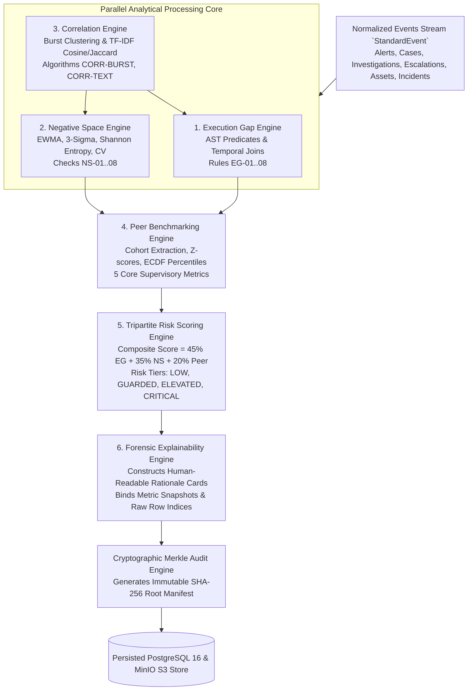
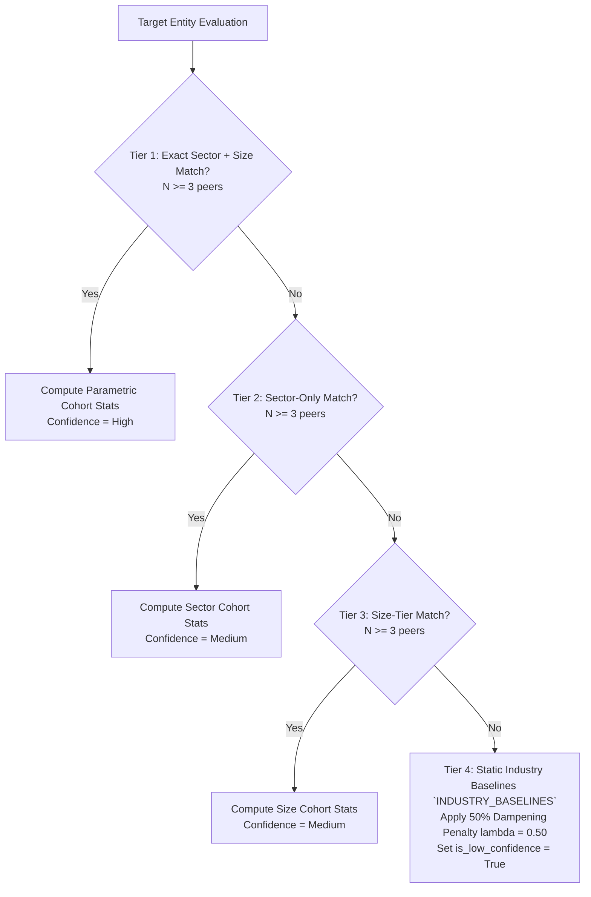

# SAT-SA — Analytics & Data Engine Guide

> **Document ID:** `04_ANALYTICS_AND_DATA_ENGINE.md`  
> **Classification:** Unclassified / Mathematical & Algorithmic Specification  
> **System Name:** SAT-SA (Sylloge Supervisory Analytics)  
> **Target Problem Statement:** PS-26157 (NCIIPC / National Critical Information Infrastructure Protection Centre)  
> **Target Audience:** Data Scientists, Security Analysts, Analytics Engineers, Algorithmic Auditors, and Technical Reviewers.  
> **Document Purpose:** Complete, exhaustive mathematical, statistical, and algorithmic specification of all 6 engines in SAT-SA: Execution Gap AST Engine, Negative Space Statistical Engine, Correlation NLP Engine, Peer Benchmarking Engine, Tripartite Risk Scoring Engine, and Explainability/Merkle Cryptographic Engine.

---

## Table of Contents

1. [Supervisory Analytics Pipeline Overview](#1-supervisory-analytics-pipeline-overview)
2. [Canonical Data Models & Ingestion Schemas](#2-canonical-data-models--ingestion-schemas)
    - 2.1 [The 8 Canonical Input Telemetry Schemas](#21-the-8-canonical-input-telemetry-schemas)
    - 2.2 [The Canonical `StandardEvent` Schema](#22-the-canonical-standardevent-schema)
    - 2.3 [Validation Rules & Row Quarantine Engine](#23-validation-rules--row-quarantine-engine)
3. [The Execution Gap AST Engine](#3-the-execution-gap-ast-engine)
    - 3.1 [AST Predicate Evaluation & Temporal Joins](#31-ast-predicate-evaluation--temporal-joins)
    - 3.2 [Authoritative MVP Rules Specification (`EG-01` to `EG-08`)](#32-authoritative-mvp-rules-specification-eg-01-to-eg-08)
    - 3.3 [Complete Extended Rulebook Catalog (`EG-09` to `EG-30`)](#33-complete-extended-rulebook-catalog-eg-09-to-eg-30)
4. [The Negative Space Statistical Engine](#4-the-negative-space-statistical-engine)
    - 4.1 [Mathematical Foundations of Absence Detection](#41-mathematical-foundations-of-absence-detection)
    - 4.2 [Authoritative MVP Checks Specification (`NS-01` to `NS-08`)](#42-authoritative-mvp-checks-specification-ns-01-to-ns-08)
    - 4.3 [Complete Extended Checks Catalog (`NS-09` to `NS-30`)](#43-complete-extended-checks-catalog-ns-09-to-ns-30)
5. [The Correlation & Anti-Gaming Engine](#5-the-correlation--anti-gaming-engine)
    - 5.1 [Same-Asset Burst Clustering (`CORR-BURST`)](#51-same-asset-burst-clustering-corr-burst)
    - 5.2 [TF-IDF Vectorization & Cosine/Jaccard Similarity (`CORR-TEXT`)](#52-tf-idf-vectorization--cosinejaccard-similarity-corr-text)
6. [The Peer Benchmarking Engine](#6-the-peer-benchmarking-engine)
    - 6.1 [The 5 Core Supervisory Metrics](#61-the-5-core-supervisory-metrics)
    - 6.2 [Parametric Z-Scores & Empirical Cumulative Distributions (ECDF)](#62-parametric-z-scores--empirical-cumulative-distributions-ecdf)
    - 6.3 [4-Tier Cohort Resolution Hierarchy & Fallback Logic](#63-4-tier-cohort-resolution-hierarchy--fallback-logic)
7. [The Tripartite Risk Scoring Engine](#7-the-tripartite-risk-scoring-engine)
    - 7.1 [Tripartite Mathematical Synthesis Formula](#71-tripartite-mathematical-synthesis-formula)
    - 7.2 [Sub-score Scaling & Volume Dampening Functions](#72-sub-score-scaling--volume-dampening-functions)
    - 7.3 [Supervisory Risk Rating Bands & Historical Trajectories](#73-supervisory-risk-rating-bands--historical-trajectories)
8. [Forensic Explainability & Merkle Audit Engine](#8-forensic-explainability--merkle-audit-engine)
    - 8.1 [Structured Rationale Card Builder](#81-structured-rationale-card-builder)
    - 8.2 [Binary SHA-256 Merkle Tree Sealing & Verification](#82-binary-sha-256-merkle-tree-sealing--verification)

---

## 1. Supervisory Analytics Pipeline Overview

The SAT-SA analytics pipeline transforms raw telemetry into court-admissible supervisory intelligence through 6 decoupled, highly specialized analytical engines:



---

## 2. Canonical Data Models & Ingestion Schemas

### 2.1 The 8 Canonical Input Telemetry Schemas

SAT-SA natively validates and maps 8 canonical SOC telemetry schemas (`shared/events/enums.py::DatasetType`):

```
+----+------------------------+------------------------------------+------------------------------------+
| #  | Dataset Name           | Primary Key                        | Key Mandatory Schema Columns       |
+----+------------------------+------------------------------------+------------------------------------+
| 01 | `alert_metadata`       | `alert_id`                         | `rule_name`, `severity`, `status`, |
|    |                        |                                    | `asset_id`, `created_at`, `closed` |
| 02 | `case_management`      | `case_id`                          | `priority`, `status`, `opened_at`, |
|    |                        |                                    | `closed_at`, `assigned_analyst`    |
| 03 | `investigation_records`| `investigation_id`                 | `case_id`, `notes`, `action_taken`,|
|    |                        |                                    | `conclusion`, `started_at`         |
| 04 | `escalation_records`   | `escalation_id`                    | `case_id`, `escalated_from`,       |
|    |                        |                                    | `escalated_to`, `escalated_at`     |
| 05 | `asset_inventory`      | `asset_id`                         | `hostname`, `ip_address`, `os`,    |
|    |                        |                                    | `criticality_tier`, `is_monitored` |
| 06 | `incident_reports`     | `incident_id`                      | `case_id`, `attack_vector`,        |
|    |                        |                                    | `root_cause`, `declared_at`        |
| 07 | `coverage_reports`     | `coverage_id`                      | `tool_name`, `source_type`,        |
|    |                        |                                    | `total_assets_monitored`, `uptime` |
| 08 | `analyst_activity`     | `activity_id`                      | `analyst_id`, `activity_type`,     |
|    |                        |                                    | `duration_seconds`, `timestamp`    |
+----+------------------------+------------------------------------+------------------------------------+
```

### 2.2 The Canonical `StandardEvent` Schema

All validated raw rows are normalized into the unified `StandardEvent` model (`shared/events/standard_event.py`):

```python
class StandardEvent(BaseModel):
    event_id: UUID = Field(default_factory=uuid4)
    submission_id: UUID
    entity_id: UUID
    dataset_type: DatasetType
    standard_event_type: StandardEventType
    event_timestamp: datetime
    asset_id: Optional[str] = None
    user_id: Optional[str] = None
    action: Optional[str] = None
    status: Optional[str] = None
    severity: Optional[SeverityTier] = None
    source_ip: Optional[str] = None
    destination_ip: Optional[str] = None
    raw_row_index: int
    raw_ref_id: Optional[str] = None
    normalized_payload: Dict[str, Any] = Field(default_factory=dict)
    created_at: datetime = Field(default_factory=lambda: datetime.now(timezone.utc))
```

### 2.3 Validation Rules & Row Quarantine Engine

The validation engine (`data_processing/app/quarantine/validator.py`) enforces strict row-level invariants:
1. **Header Presence:** Primary key and event timestamp must exist.
2. **Timestamp Monotonicity:** `closed_at >= created_at` or `opened_at <= closed_at`.
3. **Type Safety:** Severity must coerce to `CRITICAL`, `HIGH`, `MEDIUM`, `LOW`, or `INFORMATIONAL`.
4. **Quarantine Isolation:** Rows failing validation are written to `QUARANTINE_RECORDS` with exact line indices, error codes, and raw JSON payloads. Valid rows proceed without batch abortion.

---

## 3. The Execution Gap AST Engine

### 3.1 AST Predicate Evaluation & Temporal Joins

The Execution Gap Engine (`analytics_engine/app/engines/execution_gap/`) evaluates declarative Abstract Syntax Trees (AST).

```
+-----------------------------------------------------------------------------------------------+
|                            AST CONDITION TREE EVALUATION PIPELINE                             |
+-----------------------------------------------------------------------------------------------+
|  Root Condition: LogicalOperator.AND                                                          |
|  ├── Condition 1: field="severity", operator=IN, value=["CRITICAL", "HIGH"]                   |
|  └── Condition 2: LogicalOperator.OR                                                          |
|      ├── Condition 2a: field="status", operator=EQ, value="CLOSED"                            |
|      └── Condition 2b: field="delay_hours", operator=GT, value=2.0                            |
+-----------------------------------------------------------------------------------------------+
|  Temporal Join: target_dataset="investigation_records", join_key="raw_ref_id"                 |
|                 relation=NOT_EXISTS, max_time_delta_seconds=7200 (2h SLA)                     |
+-----------------------------------------------------------------------------------------------+
```

### 3.2 Authoritative MVP Rules Specification (`EG-01` to `EG-08`)

#### `EG-01` — Uninvestigated Critical / High Alerts
- **Purpose:** Detects high-priority alerts abandoned without forensic triage within statutory SLA.
- **Target Dataset:** `alert_metadata` | **Joined Dataset:** `investigation_records`
- **Predicate Logic:**
  $$\text{severity} \in \{\text{CRITICAL}, \text{HIGH}\} \land \neg \exists r \in \text{investigation\_records} \text{ s.t. } (r.\text{alert\_id} = e.\text{alert\_id} \land 0 \le t_r - t_e \le 7200\text{s})$$
- **SLA Threshold:** $7,200\text{ seconds}$ ($2.0\text{ hours}$).
- **Severity Formula:**
  $$\text{Severity} = \min\left(100.0, 70.0 + \max(0.0, \text{delay\_hours} - 2.0) \times 5.0\right), \quad \text{Confidence} = 0.95$$

#### `EG-02` — Missing Escalation After Severity Threshold
- **Purpose:** Identifies P1 Critical security cases left unescalated beyond mandatory SLA.
- **Target Dataset:** `case_management` | **Joined Dataset:** `escalation_records`
- **Predicate Logic:**
  $$\text{priority} \in \{\text{P1\_CRITICAL}, \text{CRITICAL}\} \land \text{open\_duration} \ge 4.0\text{h} \land \neg \exists \text{escalation}$$
- **SLA Threshold:** $4.0\text{ hours}$.
- **Severity Formula:** $\text{Severity} = 85.0$, $\text{Confidence} = 0.90$.

#### `EG-03` — Stale Open Cases
- **Purpose:** Surfaces dormant investigations lacking analyst updates or triage progression.
- **Target Dataset:** `case_management`
- **Predicate Logic:** $\text{status} \in \{\text{OPEN}, \text{IN\_PROGRESS}\} \land (t_{\text{now}} - t_{\text{last\_activity}}) > 72.0\text{ hours}$.
- **Severity Formula:**
  $$\text{Severity} = \min\left(100.0, 50.0 + \max(0.0, \text{idle\_days} - 3.0) \times 5.0\right), \quad \text{Confidence} = 0.85$$

#### `EG-04` — Case Closure Without Resolution Notes (Diligence Failure)
- **Purpose:** Catches non-diligent closures, empty notes, and generic stopwords.
- **Target Dataset:** `case_management`
- **Predicate Logic:**
  $$\text{status} \in \{\text{CLOSED}, \text{RESOLVED}\} \land (\text{len}(\text{notes}) < 20 \lor \text{notes} \in \{\text{"done"}, \text{"closed"}, \text{"fp"}, \text{"false positive"}\})$$
- **Severity Formula:** $\text{Severity} = 75.0$, $\text{Confidence} = 0.95$.

#### `EG-05` — Unassigned Critical Assets in Alerts
- **Purpose:** Enforces asset accountability on Crown Jewel systems triggering alerts.
- **Target Dataset:** `alert_metadata` (joined with `asset_inventory`)
- **Predicate Logic:** $\text{criticality\_tier} \in \{\text{CROWN\_JEWEL}, \text{CRITICAL}\} \land (\text{owner} = \text{NULL} \lor \text{department} = \text{NULL})$.
- **Severity Formula:** $\text{Severity} = 65.0$, $\text{Confidence} = 0.90$.

#### `EG-06` — Escalation Without Incident Record
- **Purpose:** Ensures Tier-3 IR escalations result in formal declared incident records.
- **Target Dataset:** `escalation_records` | **Joined Dataset:** `incident_reports`
- **Predicate Logic:** $\text{escalated\_to} \in \{\text{TIER\_3\_IR}, \text{MANAGEMENT}, \text{CERT}\} \land \neg \exists \text{incident within } 86400\text{s (24h)}$.
- **Severity Formula:** $\text{Severity} = 80.0$, $\text{Confidence} = 0.88$.

#### `EG-07` — Rapid Batch Case Dismissal (Rubber-Stamping)
- **Purpose:** Detects metric-gaming where a single analyst rapidly dismisses cases in bulk.
- **Target Dataset:** `case_management`
- **Sliding Window Logic:** Group closed cases by `analyst_id` sorted by $t_{\text{closed}}$. Flag if:
  $$\exists i \text{ s.t. } (t_{\text{case}[i+9]} - t_{\text{case}[i]}) \le 120\text{ seconds (10 cases in } \le 2\text{ min)}$$
- **Severity Formula:** $\text{Severity} = 90.0$, $\text{Confidence} = 0.92$.

#### `EG-08` — Off-Hours Critical Alert SLA Breach
- **Purpose:** Audits 24x7 SOC readiness during nights and weekends.
- **Target Dataset:** `alert_metadata`
- **Predicate Logic:**
  $$\text{severity} \in \{\text{CRITICAL}, \text{HIGH}\} \land (\text{hour} < 8 \lor \text{hour} \ge 18 \lor \text{weekday} \ge 5) \land \text{triage\_delay} > 60\text{ minutes}$$
- **Severity Formula:** $\text{Severity} = 85.0$, $\text{Confidence} = 0.90$.

---

### 3.3 Complete Extended Rulebook Catalog (`EG-09` to `EG-30`)

```
+----+------------------------------------+-----------------------------------+----------+
| ID | Rule Description                   | Target Detection Logic            | Severity |
+----+------------------------------------+-----------------------------------+----------+
| 09 | Escalation with No Follow-up       | Escalated case idle > 48h         | High     |
| 10 | Chronic FP Rate (>20:1 FP:TP)      | FP/TP ratio > 20 over 90 days     | Medium   |
| 11 | Off-Hours Investigation Depth Drop | Off-hours note length < 50% avg   | Medium   |
| 12 | Vendor Alerts Under-Scrutinized    | Vendor handling time < 50% avg    | Medium   |
| 13 | Exfiltration Dismissed as Benign   | Category=Exfil, Closed < 60s      | Critical |
| 14 | Rapid Ticket Reopening (>2 in 24h) | Reopened count > 2 in 24 hours    | Medium   |
| 15 | Ping-Pong Escalation (>3 Tier hops)| Reassignment count > 3            | Medium   |
| 16 | Orphaned Case (Open > 30 Days)     | Status=Open and Age > 30 days     | Medium   |
| 17 | Confirmed Incident Lacks RCA Doc   | Confirmed Incident, RCA=NULL      | High     |
| 18 | Over-reliance on Whitelisting (>5%)| Whitelist closures / Total > 5%   | Medium   |
| 19 | Missing Action Logs on Active Case | Case exists, 0 action records     | High     |
| 20 | Claimed vs Observed Coverage Gap   | Claimed % - Observed % > 20%      | High     |
| 21 | Threat Feed IoC Match Dismissed    | Matched IoC, Disposition=Benign   | Critical |
| 22 | Privileged Account Handling Parity | Privileged triage = Std triage    | High     |
| 23 | Metric-Gaming Ticket Splitting     | Multiple identical cases on asset | Medium   |
| 24 | Missing Playbook Mandated Steps    | < 50% playbook steps logged       | High     |
| 25 | No Segregation of Duties (>90%)    | Same analyst opens & closes 90%+  | Medium   |
| 26 | Zero Disposition Entropy in Cat.   | Disposition entropy H(X) ≈ 0      | Medium   |
| 27 | High Analyst MTTR Variance (CV>1.5)| MTTR CV > 1.5 for same alert type | Low      |
| 28 | Weekend MTTR Spike (>5x Weekday)   | Weekend MTTR > 5x Weekday MTTR    | High     |
| 29 | Malware Closed with No Containment | Malware, 0 Isolate/Quarantine     | Critical |
| 30 | Missing Post-Incident Review (PIR) | Confirmed Incident, PIR=NULL      | Medium   |
+----+------------------------------------+-----------------------------------+----------+
```

---

## 4. The Negative Space Statistical Engine

### 4.1 Mathematical Foundations of Absence Detection

Absence detection proves that the *non-existence* of events is statistically significant.

```
+-----------------------------------------------------------------------------------------------+
|                            MATHEMATICAL ABSENCE FORMULATIONS                                  |
+-----------------------------------------------------------------------------------------------+
|  1. Exponentially Weighted Moving Average (EWMA):                                             |
|     S_t = \alpha Y_t + (1 - \alpha) S_{t-1}, \quad \text{where } \alpha = 0.20                |
|     \text{Memory time constant: } \tau \approx 1/\alpha = 5.0 \text{ days}                    |
|                                                                                               |
|  2. Shewhart 3-Sigma Control Limit:                                                           |
|     \text{Lower Bound} = \max\left(0.0, \mu_{\text{EWMA}} - 3.0 \cdot \sigma\right)          |
|                                                                                               |
|  3. Categorical Shannon Entropy:                                                              |
|     H(X) = -\sum_{i=1}^M p(x_i) \log_2 p(x_i) \quad \text{across } M \text{ alert categories}|
|                                                                                               |
|  4. Inter-Arrival Coefficient of Variation:                                                   |
|     CV = \frac{\sigma_{\Delta t}}{\mu_{\Delta t}} = \frac{\sqrt{\text{Var}(\Delta t)}}{\text{Mean}(\Delta t)} |
+-----------------------------------------------------------------------------------------------+
```

---

### 4.2 Authoritative MVP Checks Specification (`NS-01` to `NS-08`)

#### `NS-01` — EWMA Volume Cliff / Sudden Sensor Silence
- **Purpose:** Identifies abrupt sensor failures, log pipeline disruptions, or deliberate logging cuts.
- **Mathematical Logic:** Evaluates daily alert volume $Y_1, \dots, Y_t$. Flags if:
  $$Y_t < (\mu_{\text{EWMA}} - 3.0\sigma) \land \frac{\mu_{\text{EWMA}} - Y_t}{\mu_{\text{EWMA}}} > 0.70 \quad (\ge 70\% \text{ drop})$$
- **Severity Formula:** $\text{Severity} = 85.0$, $\text{Confidence} = 0.90$.

#### `NS-02` — Missing Weekend / Off-Hours Analyst Activity
- **Purpose:** Detects complete operational abandonment during weekends despite active security alerts.
- **Mathematical Logic:**
  $$\text{Weekend Alert Volume} \ge 20 \land \text{Weekend Analyst Console Activity Logs} = 0$$
- **Severity Formula:** $\text{Severity} = 80.0$, $\text{Confidence} = 0.95$.

#### `NS-03` — Zero Coverage on Crown-Jewel Assets
- **Purpose:** Surfaces mission-critical systems operating without any EDR/SIEM telemetry stream.
- **Mathematical Logic:** Cross-references `asset_inventory` where `criticality_tier == CROWN_JEWEL` against `alert_metadata` and `coverage_reports`. Flags if:
  $$\text{Count}(\text{Telemetry Events for Asset } A) = 0 \quad \forall t \in \text{Period}$$
- **Severity Formula:** $\text{Severity} = 95.0$, $\text{Confidence} = 0.98$.

#### `NS-04` — Asymmetric Case Closure vs. Creation Rate
- **Purpose:** Detects severe triage backlog collapse where tickets accumulate unhandled.
- **Mathematical Logic:**
  $$\text{Created Cases } N_{\text{created}} \ge 30 \land \text{Closure Rate } \left(\frac{N_{\text{closed}}}{N_{\text{created}}}\right) < 0.10 \quad (< 10\%)$$
- **Severity Formula:** $\text{Severity} = 75.0$, $\text{Confidence} = 0.85$.

#### `NS-05` — Missing Escalations on High-Severity Alert Spike
- **Purpose:** Detects escalation blindness during major attack surges.
- **Mathematical Logic:**
  $$\text{Surge of High/Critical Alerts in 24h } \ge 20 \land \text{Total Escalation Records} = 0$$
- **Severity Formula:** $\text{Severity} = 88.0$, $\text{Confidence} = 0.88$.

#### `NS-06` — Low Categorical Shannon Entropy (Sensor Blindness / Monoculture)
- **Purpose:** Catches detection monocultures where SIEM rules are disabled, leaving only a single noisy ping rule.
- **Mathematical Logic:** Across $N \ge 50$ alerts, computes category probability distribution $p(x_i)$. Flags if:
  $$H(X) = -\sum_{i=1}^M p(x_i) \log_2 p(x_i) < 0.50\text{ bits}$$
- **Severity Formula:** $\text{Severity} = 70.0$, $\text{Confidence} = 0.82$.

#### `NS-07` — Unnaturally Constant Alert Intervals (Synthetic Heartbeat Telemetry)
- **Purpose:** Detects fabricated or looping synthetic compliance feeds using inter-arrival dispersion.
- **Mathematical Logic:** For timestamps $t_1, t_2, \dots, t_N$ ($N \ge 20$), computes intervals $\Delta t_i = t_{i+1} - t_i$. Flags if:
  $$CV = \frac{\sigma_{\Delta t}}{\mu_{\Delta t}} < 0.01 \quad (\text{Deterministic periodic pulse})$$
- **Severity Formula:** $\text{Severity} = 85.0$, $\text{Confidence} = 0.92$.

#### `NS-08` — Missing Post-Incident Remediation / Audit Trace
- **Purpose:** Audits closed critical incidents to verify mandatory architectural remediation was deployed.
- **Mathematical Logic:**
  $$\exists \text{ Incident } I \text{ marked RESOLVED } > 14\text{ days ago } \land \neg \exists \text{ Remediation/Coverage Update}$$
- **Severity Formula:** $\text{Severity} = 65.0$, $\text{Confidence} = 0.80$.

---

### 4.3 Complete Extended Checks Catalog (`NS-09` to `NS-30`)

```
+----+------------------------------------+-----------------------------------+----------+
| ID | Check Description                  | Diagnostic Missing Evidence       | Severity |
+----+------------------------------------+-----------------------------------+----------+
| 09 | Escalations Exist, 0 Follow-up     | Subsequent case activity = 0      | High     |
| 10 | Remote Access Assets, 0 VPN Alerts | Remote assets exist, 0 VPN logs   | Critical |
| 11 | Zero Off-Hours Alerts (All Period) | Alerts between 18:00-08:00 = 0    | High     |
| 12 | 3rd-Party Access, 0 Vendor Alerts  | Vendor access active, 0 alerts    | High     |
| 13 | Zero Failed-Login Alerts (90 Days) | Failed login events = 0           | Critical |
| 14 | Zero DLP / Exfiltration Alerts     | Outbound transfer alerts = 0      | Critical |
| 15 | Vulnerability Scanner Feeds Silent | Vuln scanner alert count = 0      | Medium   |
| 16 | Zero Phishing Reports from Users   | User-reported tickets = 0         | Medium   |
| 17 | Zero Threat Feed Matches           | Feed enabled, IoC matches = 0     | High     |
| 18 | Legacy / Unpatched Systems Dark    | Legacy tagged systems, 0 logs     | Critical |
| 19 | Zero Access Revocation Cases       | HR departures > 0, Revocations = 0| High     |
| 20 | Escalation Rate < 5th Percentile   | Escalation rate below cohort floor| High     |
| 21 | Zero Cloud Infrastructure Telemetry| Cloud usage active, CSPM logs = 0 | High     |
| 22 | VIP / Privileged Accounts Dark     | Domain Admin activity, 0 alerts   | High     |
| 23 | Zero East-West / Lateral Alerts    | Perimeter active, Internal = 0    | High     |
| 24 | Zero MFA-Failure Alerts Recorded   | MFA claimed, Failure count = 0    | Medium   |
| 25 | Zero Insider-Threat Alert Signals  | Insider threat category = 0       | Medium   |
| 26 | High Alert Volume, 0 Incidents     | Critical alerts > 500, Incidents=0| High     |
| 27 | Asset Criticality Metadata Stale   | CMDB last_updated > 12 months     | Medium   |
| 28 | High/Critical Alerts, Case=NULL    | High alerts with no ticket ID     | High     |
| 29 | Universal Category Absent vs Peers | Peer category presence >= 95%     | Medium   |
| 30 | Claimed Coverage vs Source Variety | High coverage %, 1 alert source   | Medium   |
+----+------------------------------------+-----------------------------------+----------+
```

---

## 5. The Correlation & Anti-Gaming Engine

### 5.1 Same-Asset Burst Clustering (`CORR-BURST`)
Identifies unresolved, persistent attack campaigns hitting the same host:
- **Algorithm:** Sliding 24-hour time window group-by `asset_id`.
- **Threshold:** $\ge 3\text{ High/Critical alerts}$ on the same asset within 24 hours without an escalation record.
- **Output:** Emits a `Correlation` draft linking the clustered event UUIDs.

### 5.2 TF-IDF Vectorization & Cosine/Jaccard Similarity (`CORR-TEXT`)
Detects copy-paste investigations and boilerplate templates across distinct cases:
1. **Preprocessing:** Lowercase, punctuation strip, tokenization, stopword removal (`STOP_WORDS` dictionary of 38 words), and minimum token count filter ($\ge 10\text{ tokens}$).
2. **TF-IDF Matrix Generation:**
   $$w_{t,d} = \text{TF}(t, d) \times \left(\log \frac{1 + N}{1 + \text{DF}(t)} + 1\right)$$
3. **Cosine Similarity Computation:**
   $$\cos(\theta) = \frac{\mathbf{u} \cdot \mathbf{v}}{\|\mathbf{u}\|_2 \|\mathbf{v}\|_2} \ge 0.85$$
4. **Jaccard Token Verification:**
   $$J(A, B) = \frac{|A \cap B|}{|A \cup B|} \ge 0.80$$
- **Finding Emitted:** If both thresholds are met across distinct case IDs, a `CORR-TEXT` finding is raised for boilerplate review gaming.

---

## 6. The Peer Benchmarking Engine

### 6.1 The 5 Core Supervisory Metrics

```
+----+----------------------+---------------------------------------------------+
| #  | Metric Name          | Formula & Operational Definition                  |
+----+----------------------+---------------------------------------------------+
| 01 | `mtti_minutes`       | Mean Time to Investigate (Alert timestamp to      |
|    |                      | Investigation start timestamp)                    |
| 02 | `escalation_rate`    | Ratio of escalated critical cases to total        |
|    |                      | critical cases: N_esc / N_crit                    |
| 03 | `stale_case_ratio`   | Ratio of cases idle > 72h to total open cases     |
| 04 | `coverage_gap_ratio` | Ratio of unmonitored assets to total asset count  |
| 05 | `execution_gap_rate` | Number of Execution Gap violations per 100 alerts |
+----+----------------------+---------------------------------------------------+
```

### 6.2 Parametric Z-Scores & Empirical Cumulative Distributions (ECDF)
- **Z-Score Formula:**
  $$Z_i = \frac{X_i - \mu_{\text{cohort}}}{\sigma_{\text{cohort}}}$$
- **ECDF Percentile Rank:**
  $$\hat{F}_n(t) = \frac{1}{n} \sum_{i=1}^n \mathbf{1}_{\{X_i \le t\}} \times 100\%$$

### 6.3 4-Tier Cohort Resolution Hierarchy & Fallback Logic



---

## 7. The Tripartite Risk Scoring Engine

### 7.1 Tripartite Mathematical Synthesis Formula

The authoritative composite risk score is evaluated via `analytics_engine/app/engines/risk_scoring/formulas.py`:

$$\text{Composite Risk Score} = (0.45 \cdot S_{\text{EG}}) + (0.35 \cdot S_{\text{NS}}) + (0.20 \cdot S_{\text{Peer}})$$

```
+-----------------------------------------------------------------------------------------------+
|                            SUB-SCORE FORMULATION BREAKDOWN                                    |
+-----------------------------------------------------------------------------------------------+
|  1. Execution Gap Sub-Score (S_EG \in [0.0, 100.0]):                                          |
|     S_{\text{EG}} = \min\left(100.0, \sum_{i=1}^{N_{\text{EG}}} \left(\frac{\text{sev}_i}{100.0} \cdot \text{conf}_i \cdot w_{\text{type}}\right) \cdot \frac{100.0}{\text{ScaleFactor}}\right) |
|     \text{where } \text{ScaleFactor} = \max\left(10.0, \log_{10}(\text{alerts} + 10.0) \cdot 5.0\right) |
|                                                                                               |
|  2. Negative Space Sub-Score (S_NS \in [0.0, 100.0]):                                         |
|     S_{\text{NS}} = \min\left(100.0, \sum_{j=1}^{N_{\text{NS}}} \left(\frac{\text{sev}_j}{100.0} \cdot \text{conf}_j \cdot w_{\text{deg}, j} \cdot 20.0\right)\right) |
|     \text{where } w_{\text{deg}} = \min(1.0, \sqrt{N/N_{\text{min}}}) \text{ prevents low-sample noise} |
|                                                                                               |
|  3. Peer Outlier Sub-Score (S_Peer \in [0.0, 100.0]):                                         |
|     S_{\text{Peer}} = \min\left(100.0, \max\left(0.0, 50.0 + (25.0 \cdot \bar{Z}_{\text{risk}} \cdot \lambda_{\text{dampen}})\right)\right) |
+-----------------------------------------------------------------------------------------------+
```

### 7.2 Supervisory Risk Rating Bands & Historical Trajectories

```
+----------------+------------------+---------------------------------------------------+
| Risk Tier Band | Score Range      | Mandatory Supervisory Action                      |
+----------------+------------------+---------------------------------------------------+
| `LOW`          | 0.0 - 25.0       | Nominal compliance; routine quarterly monitoring  |
| `GUARDED`      | 25.1 - 50.0      | Minor execution gaps; voluntary remediation plan  |
| `ELEVATED`     | 50.1 - 75.0      | Systemic SLA breaches; formal inquiry notice      |
| `CRITICAL`     | 75.1 - 100.0     | Severe policy abandonment; on-site intervention   |
+----------------+------------------+---------------------------------------------------+
```

- **Trend Direction:**
  - `IMPROVING`: Current Score $\le$ Previous Score $- 5.0$
  - `DETERIORATING`: Current Score $\ge$ Previous Score $+ 5.0$
  - `STABLE`: $| \Delta\text{Score} | < 5.0$

---

## 8. Forensic Explainability & Merkle Audit Engine

### 8.1 Structured Rationale Card Builder

Every finding emitted by the engines is converted into a plain-language `RationaleCard` (`ExplainabilityEngine`):
- **Plain-Language Summary:** E.g., *"14 Critical P1 alerts remained unescalated beyond the 4-hour SLA."*
- **Quantitative Snapshot:** E.g., `{"delay_hours": 101.8, "sla_threshold": 4.0, "breach_count": 14}`.
- **Forensic Lineage:** Pointers to `evidence_record_ids` (UUIDs) and `raw_row_indices` (line 412 in uploaded CSV).

### 8.2 Binary SHA-256 Merkle Tree Sealing & Verification

To establish cryptographic non-repudiation, the `audit_service` constructs a binary SHA-256 Merkle Tree:

```
                  [Composite Manifest Root SHA-256]
                                 ▲
            ┌────────────────────┴────────────────────┐
     [Hash(Raw || Quarantined)]              [Hash(Events || Findings)]
            ▲                                         ▲
     ┌──────┴──────┐                           ┌──────┴──────┐
 [H_raw]     [H_quarantine]               [H_events]    [H_findings]
    ▲               ▲                          ▲              ▲
(Raw Files)  (Quarantine DB)             (Norm Events)  (Finding DB)
```

$$\text{Root SHA-256} = \text{SHA256}(\text{SortConcat}(H_{\text{raw}} \parallel H_{\text{quarantine}} \parallel H_{\text{normalized}} \parallel H_{\text{findings}}))$$

If any record in PostgreSQL or raw file in MinIO is altered after ingestion, recomputing the tree produces a mismatched root hash, immediately alerting regulators to unauthorized evidence tampering.

---
*End of Document 04 — Analytics & Data Engine Guide. For operations, local startup, and testing instructions, refer to `05_OPERATIONS_DEPLOYMENT_AND_DEVELOPER_GUIDE.md`.*
