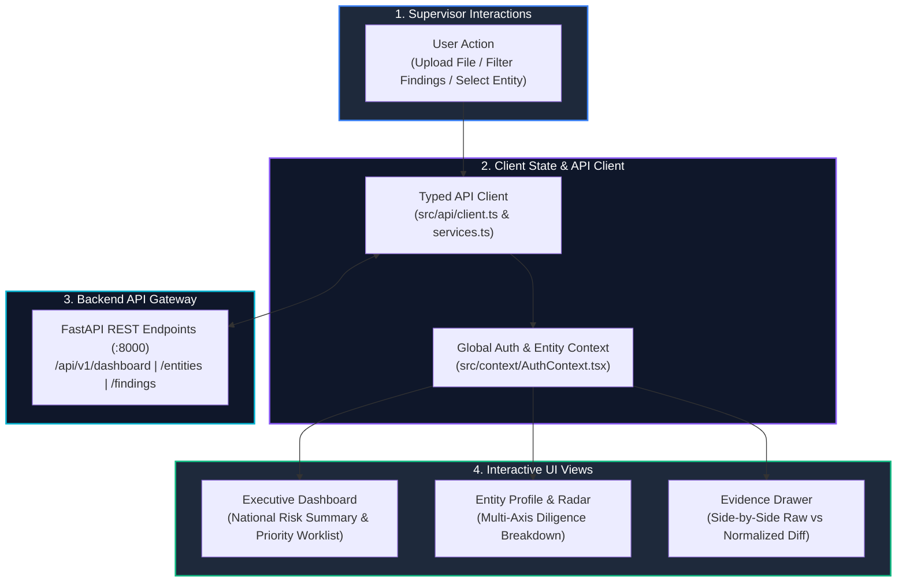

# Frontend Subsystem (`frontend/`)

> **Air-Gapped React 18 SPA Dashboard** providing real-time supervisory risk rankings, multi-axis radar profiles, and drill-down evidence verification.

---

## 🎯 Purpose
- Serves as the primary operational console for NCIIPC regulatory inspectors and SOC supervisors.
- Renders institutional risk scores, SLA breach findings, and telemetry absence indicators in real time.
- Facilitates multi-file telemetry uploads, processing pipeline visualizers, and raw-vs-normalized diff analysis.
- Operates strictly offline with zero external network calls, remote CDNs, or third-party web font dependencies.

---

## 💎 Why This Subsystem Is Critical
- **Decision Enablement:** Translates complex AST predicates and mathematical Z-scores into intuitive visual intelligence.
- **Forensic Drill-Down:** Enables inspectors to trace high-level risk scores directly to line-by-line raw CSV evidence rows.
- **Enclave Compliance:** Engineered specifically for isolated, air-gapped government regulatory deployments.

---

## 🧩 Main Components & Directory Map

```text
frontend/src/
├── pages/                   # The 6 Core Supervisory Views
│   ├── DashboardPage.tsx         # Executive worklist & national risk overview
│   ├── UploadWorkflowPage.tsx    # 5-step telemetry upload & ingestion wizard
│   ├── EntityAssessmentPage.tsx  # Entity risk breakdown, radar & sparklines
│   ├── FindingsExplorerPage.tsx  # Filterable findings catalog with severity badges
│   ├── ReportsPage.tsx           # Compliance report generator & PDF export
│   └── AuditTrailPage.tsx        # Cryptographic Merkle audit trail
├── components/              # Reusable UI widgets (Navbar, StatCards, RadarChart, EvidenceDrawer)
├── context/                 # React Context for JWT auth state & active entity selection
├── api/                     # Typed HTTP API client (client.ts) & endpoint bindings (services.ts)
├── types/                   # TypeScript interfaces (Entity, Finding, Event, RiskScore)
└── utils/                   # Client-side dataset auto-detector (datasetDetector.ts) & formatters
```

---

## ⚙️ Key Responsibilities
- Render reactive supervisory dashboards, cohort distributions, and trend sparklines.
- Handle drag-and-drop CSV/JSON uploads with client-side header auto-detection.
- Provide interactive side-by-side evidence diff inspections for detected findings.
- Generate and download court-admissible PDF compliance audit dossiers.

---

## 🔄 Supervisory UI Reactive Data Flow



---

## 📚 Related Master Documentation
- [**Doc 01: Product & Business Guide**](../docs/01_PRODUCT_AND_BUSINESS_GUIDE.md) (Section 12: The 6 Core Supervisory Views)
- [**Doc 02: System Architecture Guide**](../docs/02_SYSTEM_ARCHITECTURE.md) (Section 5: Frontend Architecture)
- [**Doc 03: Codebase & Tech Stack Guide**](../docs/03_CODEBASE_AND_TECH_STACK_GUIDE.md) (Section 3.6: Frontend Client)

