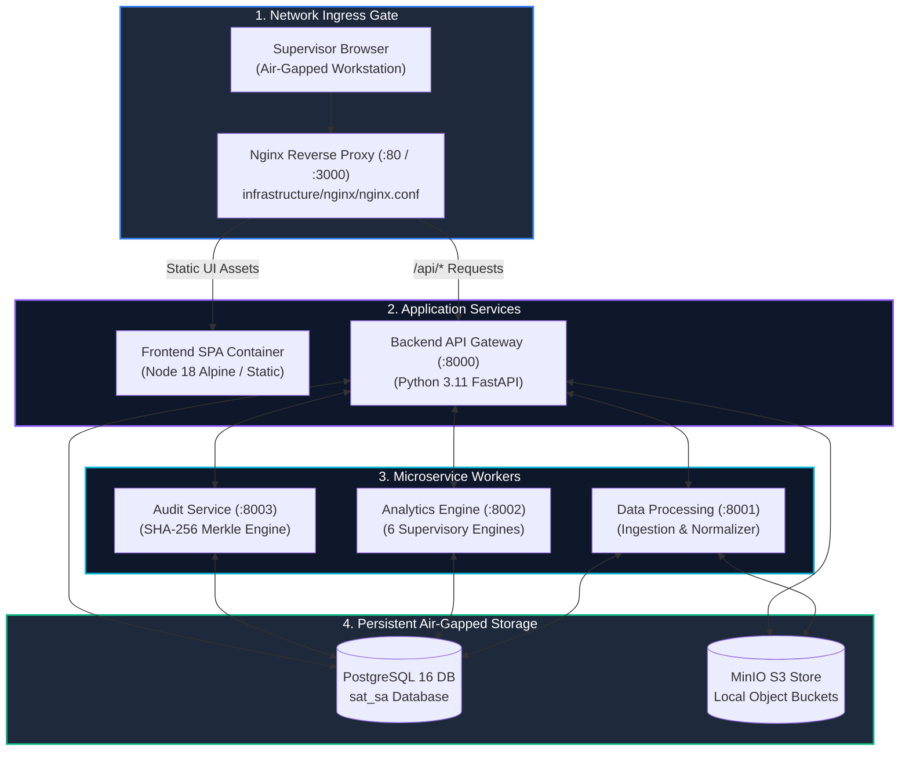

# Infrastructure & Deployment (`infrastructure/`)

> **Container & Deployment Configurations** orchestrating Docker Compose multi-service stacks, Nginx reverse proxy routing, and PostgreSQL initialization scripts.

---

## 🎯 Purpose
- Houses all infrastructure-as-code, container definitions, and reverse proxy routing configurations.
- Enables one-click deployment of the entire 5-microservice platform inside air-gapped environments.
- Defines production Nginx reverse proxy routing and SSL termination.
- Manages relational database bootstrap scripts and extension configurations.

---

## 💎 Why This Subsystem Is Critical
- **Air-Gap Provisioning:** Ensures the platform can be cleanly deployed on an isolated host without internet connectivity.
- **Service Orchestration:** Defines networking, container startup dependencies, health checks, and volume mounts.
- **Routing & Isolation:** Routes client web requests cleanly to frontend and backend services via a single unified ingress port.

---

## 🧩 Main Components & Directory Map

```text
infrastructure/
├── nginx/
│   ├── nginx.conf           # Production Nginx reverse proxy configuration & routing
│   └── Dockerfile           # Nginx container definition
├── postgres/
│   └── init.sql             # Initial database bootstrap & extension creation
└── docker-compose.yml       # Master 5-service local deployment stack (in root)
```

---

## ⚙️ Key Responsibilities
- Define multi-container runtime environment and port mappings.
- Provide persistent local storage volumes for PostgreSQL and MinIO S3 data.
- Manage service health checks and restart policies.
- Ensure zero-internet isolation across container networks.

---

## 🔄 Air-Gapped Container Ingress Topology



---

## 📚 Related Master Documentation
- [**Doc 02: System Architecture Guide**](../docs/02_SYSTEM_ARCHITECTURE.md) (Section 15: Physical Air-Gap Deployment Architecture)
- [**Doc 05: Operations & Developer Guide**](../docs/05_OPERATIONS_DEPLOYMENT_AND_DEVELOPER_GUIDE.md) (Section 2: Air-Gapped Deployment & Docker)

