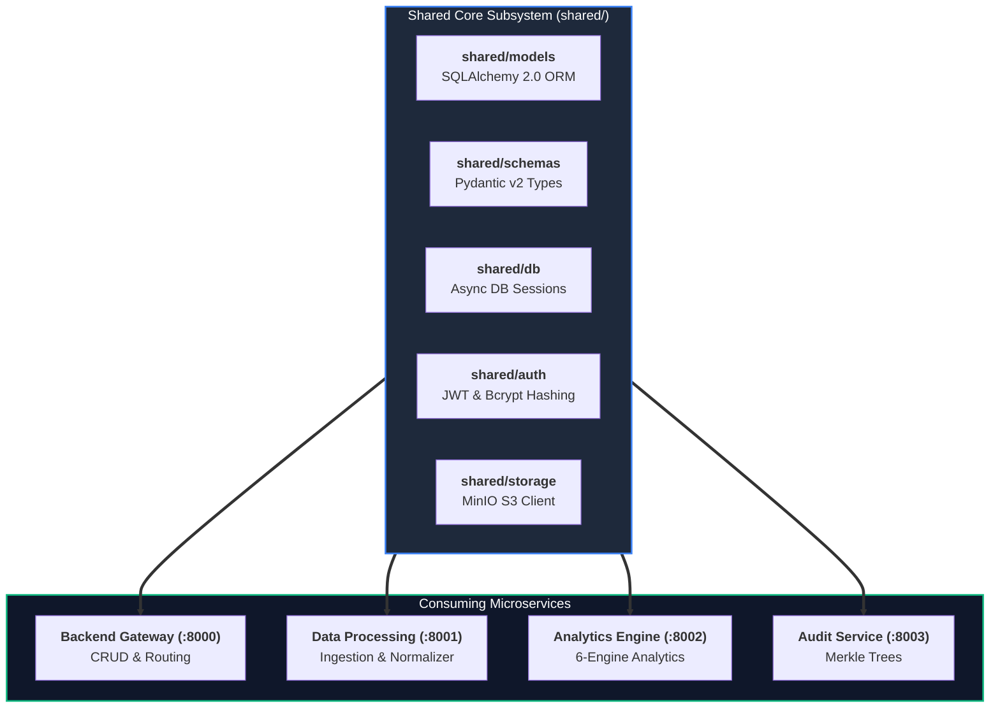

# Shared Core Library (`shared/`)

> **Internal Python Core Library** containing database ORM models, Pydantic validation schemas, database session managers, authentication helpers, and MinIO S3 storage adapters.

---

## 🎯 Purpose
- Centralizes shared Python domain models, Pydantic validation schemas, and database session utilities.
- Provides common authentication, JWT token handling, and password hashing logic across microservices.
- Implements shared storage clients for interacting with local MinIO S3 object storage.
- Standardizes structured JSON logging and canonical enums across all backend components.

---

## 💎 Why This Subsystem Is Critical
- **DRY Architecture:** Eliminates code duplication across `backend`, `analytics_engine`, `data_processing`, and `audit_service`.
- **Schema Consistency:** Ensures all Python microservices operate on the exact same SQLAlchemy model definitions and Pydantic validation types.
- **Centralized Security:** Enforces uniform JWT validation, bcrypt password hashing, and session management platform-wide.

---

## 🧩 Main Components & Directory Map

```text
shared/
├── models/                  # SQLAlchemy 2.0 ORM database models
│   ├── entity.py            # Supervised critical entity definitions
│   ├── event.py             # StandardEvent normalized telemetry records
│   ├── finding.py           # ExecutionGap & NegativeSpace finding models
│   ├── risk_score.py        # Composite & sub-score risk records
│   ├── quarantine.py        # Quarantined bad row records
│   ├── audit.py             # SHA-256 Merkle audit manifest records
│   ├── benchmark.py         # Sector peer cohort benchmark models
│   └── correlation.py       # Cross-event correlation & cluster models
├── schemas/                 # Pydantic v2 validation & response models
│   ├── auth.py              # JWT TokenPayload & user credentials schemas
│   ├── event.py             # Canonical StandardEvent schemas
│   ├── finding.py           # Typed finding & Rationale Card schemas
│   ├── risk_score.py        # Risk score calculation schemas
│   └── submission.py        # Ingestion result & file metadata schemas
├── db/                      # Database engine, connection pooling & async sessions (session.py)
├── auth/                    # JWT token creation, verification & Bcrypt hashing (jwt.py, dependencies.py)
├── storage/                 # MinIO S3 object storage client (minio_client.py)
├── events/                  # Canonical enums (DatasetType, SeverityTier, FindingStatus)
└── logging/                 # Structured JSON logging formatters
```

---

## ⚙️ Key Responsibilities
- Provide unified database models and session managers to all services.
- Enforce schema contracts at microservice boundaries.
- Manage air-gapped S3 bucket lifecycles and file streaming.
- Standardize error formats and application logging.

---

## 🔄 Shared Library Cross-Service Consumption



---

## 📚 Related Master Documentation
- [**Doc 02: System Architecture Guide**](../docs/02_SYSTEM_ARCHITECTURE.md) (Section 10: Database Architecture & Relational Schema)
- [**Doc 03: Codebase & Tech Stack Guide**](../docs/03_CODEBASE_AND_TECH_STACK_GUIDE.md) (Section 3.5: Shared Library Breakdown)

