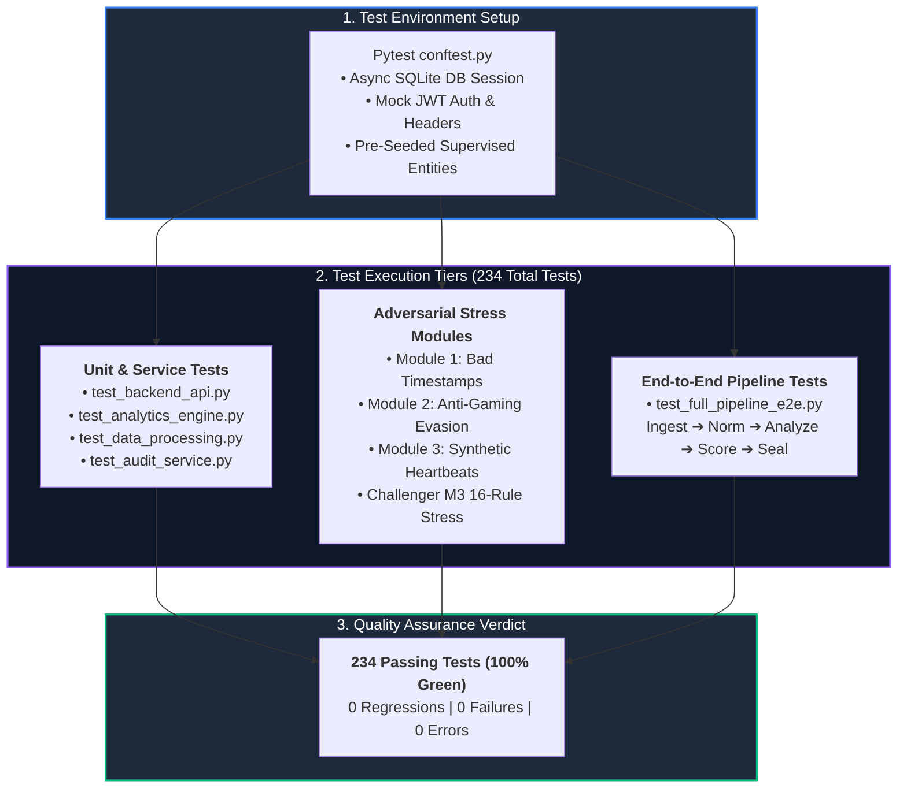

# Test & Verification Suite (`testing/`)

> **Master 234-Test Verification Suite** covering unit tests, service integration tests, adversarial stress modules, and end-to-end pipeline verification.

---

## 🎯 Purpose
- Maintains the comprehensive 234-test automated verification suite for the SAT-SA platform.
- Validates mathematical precision, schema integrity, and rule correctness across all analytics engines.
- Conducts adversarial stress testing against corrupted headers, metric gaming, and synthetic heartbeats.
- Verifies end-to-end integration flows from raw file ingestion down to risk scoring and Merkle sealing.

---

## 💎 Why This Subsystem Is Critical
- **Quality Assurance:** Guarantees that code refactoring does not introduce analytical regressions or silent detection failures.
- **Adversarial Resilience:** Tests system robustness against evasion techniques (such as synthetic periodic heartbeats or rapid batch closures).
- **Statutory Reliability:** Proves to evaluators and regulators that the platform's outputs are 100% reproducible and mathematically sound.

---

## 🧩 Main Components & Test Inventory

```text
testing/
├── conftest.py                      # Master Pytest fixtures (SQLite Async DB, mock tokens, entities)
├── test_full_pipeline_e2e.py        # End-to-end multi-service ingestion-to-scoring verification
├── test_backend_api.py              # FastAPI endpoint CRUD, auth & finding tests
├── test_analytics_engine.py         # 6-engine analytics verification tests
{{ ... }}
├── test_challenger_m3_stress.py     # 16-Rule individual adversarial stress validation
├── test_shared_models.py            # SQLAlchemy ORM model verification
├── test_shared_schemas.py           # Pydantic schema validation tests
├── test_shared_auth.py              # JWT token & Bcrypt hashing tests
└── test_shared_storage.py           # MinIO S3 object storage mock tests
```

---

## ⚙️ Key Responsibilities
- Execute unit and integration tests across all microservices.
- Verify 16 core rules (8 Execution Gap + 8 Negative Space) against seeded anomalies.
- Test quarantine error handling and data recovery mechanisms.
- Assert mathematical bounds on Shannon entropy, inter-arrival dispersion ($C_v$), and Z-scores.

---

## 🔄 Test Suite Verification Topology



---

## 📚 Related Master Documentation
- [**Doc 05: Operations & Developer Guide**](../docs/05_OPERATIONS_DEPLOYMENT_AND_DEVELOPER_GUIDE.md) (Section 3: Testing & QA Framework)
