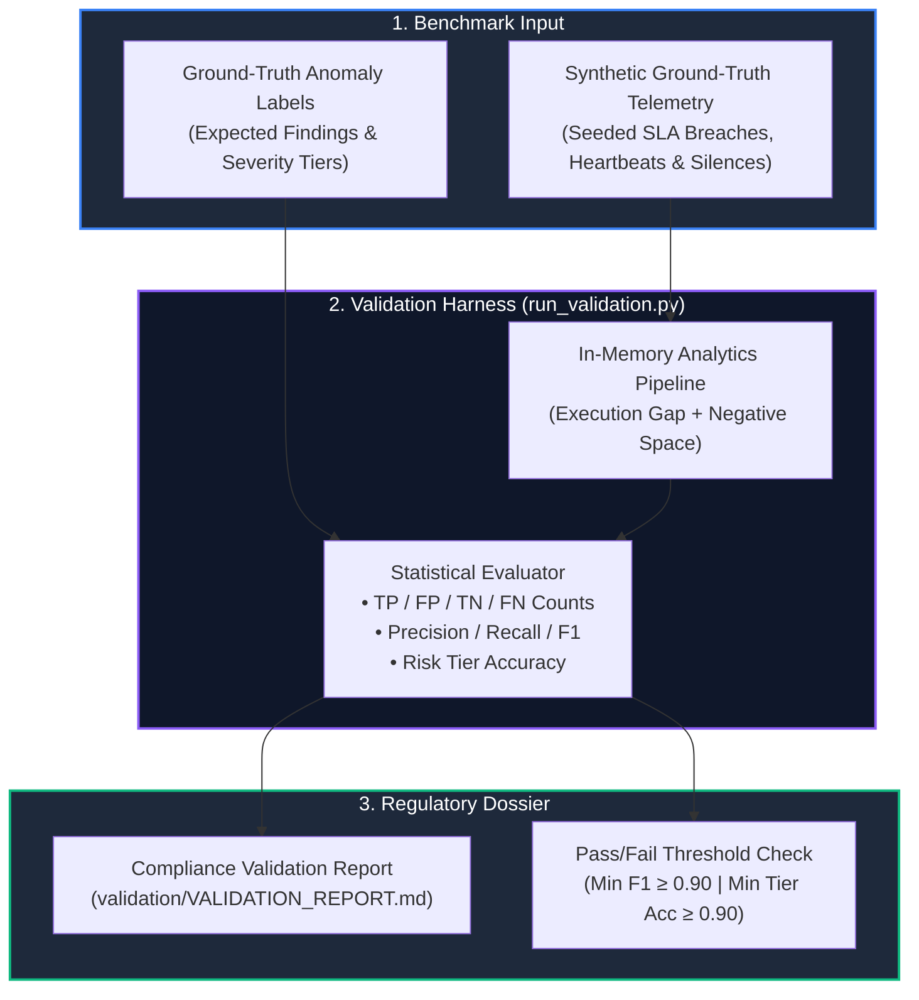

# Automated Validation CLI (`validation/`)

> **Automated Precision / Recall Benchmark CLI** evaluating analytics accuracy against ground-truth datasets and generating regulatory audit reports.

---

## 🎯 Purpose
- Provides an automated precision/recall evaluation CLI assessing analytics accuracy against ground-truth benchmarks.
- Calculates mathematical Confusion Matrices, Precision, Recall, F1-Scores, and Risk Tier Accuracies.
- Generates formal, formatted markdown compliance audit reports (`VALIDATION_REPORT.md`).

---

## 💎 Why This Subsystem Is Critical
- **Model Evaluation:** Provides empirical proof of detection accuracy against known synthetic ground-truth datasets.
- **Compliance Reporting:** Auto-generates structured validation dossiers required for regulatory accreditation and SIH evaluation.
- **Benchmark Governance:** Allows developers to test rule threshold adjustments and measure their impact on false-positive rates.

---

## 🧩 Main Components & Directory Map

```text
validation/
├── run_validation.py        # Standalone validation CLI runner
└── VALIDATION_REPORT.md     # Auto-generated markdown compliance report
```

---

## ⚙️ Key Responsibilities
- Ingest synthetic ground-truth datasets with known planted anomalies.
- Compare pipeline findings against expected ground-truth labels.
- Calculate True Positives (TP), False Positives (FP), False Negatives (FN), Precision, and Recall.
- Output compliance audit reports with pass/fail threshold evaluation.

---

## 🔄 Benchmark Evaluation Flow



---

## 📚 Related Master Documentation
- [**Doc 05: Operations & Developer Guide**](../docs/05_OPERATIONS_DEPLOYMENT_AND_DEVELOPER_GUIDE.md) (Section 3.3: Automated Validation Suite Runner)

